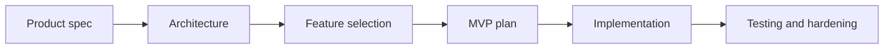

# ScopeForge

ScopeForge is a clean-room AI-assisted security testing platform inspired by the broad product category of autonomous penetration testing orchestration. The goal is to design and build our own system from first principles, using the reference project only to understand the problem space.

ScopeForge will help authorized security teams plan tests, run tools inside isolated environments, stream results, preserve evidence, and produce useful reports. It is not intended for unauthorized access, stealth operations, malware delivery, or activity against systems without explicit permission.

## Documentation

Start here:

- [Product Spec](docs/PRODUCT_SPEC.md)
- [Tech Stack Decision](docs/TECH_STACK_DECISION.md)
- [Architecture](docs/ARCHITECTURE.md)
- [Database Design](docs/DATABASE_DESIGN.md)
- [Project Phases](docs/PROJECT_PHASES.md)
- [Feature Ideas](docs/FEATURE_IDEAS.md)
- [Development Guide](docs/DEVELOPMENT.md)
- [CI/CD Pipeline Guide](docs/CI_CD.md)
- [Senior Engineering Interview Guide](docs/INTERVIEW_PREP.md)

Design contracts:

- [Auth Design](docs/design/AUTH_DESIGN.md)
- [API Design](docs/design/API_DESIGN.md)
- [Runtime Service Design](docs/design/RUNTIME_SERVICE_DESIGN.md)
- [Agent and Tool Design](docs/design/AGENT_AND_TOOL_DESIGN.md)
- [Security Policy Design](docs/design/SECURITY_POLICY_DESIGN.md)

The MVP plan is intentionally not included yet. We will add it after the product direction, architecture, and feature priorities are clearer.

## Current Status

This repository contains the ScopeForge planning documentation and implementation scaffold. The scaffold includes a FastAPI API service, React/Vite frontend, Celery worker, internal runtime service, Alembic migration folder, and Docker Compose baseline.



## Product Direction

At a high level, the product should provide:

- A web workspace for creating and monitoring security testing sessions.
- An agent orchestration engine that decomposes objectives into tasks and tool calls.
- A sandbox runtime for running approved commands and tools.
- Provider adapters for multiple LLM and embedding backends.
- Evidence, logs, files, screenshots, and reports tied to each test session.
- Administrative controls for scope, approvals, rate limits, users, roles, and audit trails.

## Safety Boundary

The product must be designed for authorized security work. That means:

- Users should define explicit scope before execution.
- Risky operations should support approval gates.
- Every command, file change, tool call, and generated result should be logged.
- The sandbox should isolate tools from the host and from unrelated targets.
- Reports should preserve enough evidence to review what happened.

## Repository Shape

The current scaffold follows this structure:

```text
.
|-- docs/
|-- apps/
|   |-- web/
|   `-- api/
|-- services/
|   |-- worker/
|   |-- runtime/
|-- packages/
|   |-- shared/
|-- infra/
|   |-- compose/
|   |-- migrations/
|-- docker-compose.yml
|-- .env.example
`-- scripts/
```
