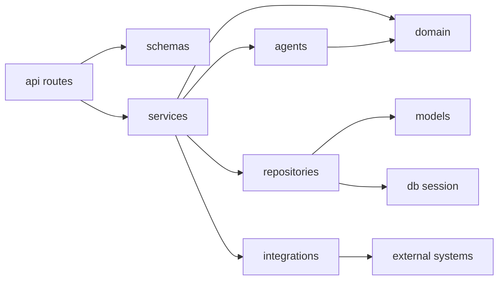

# API Backend Structure

The API backend is intentionally layered. Keep code moving inward through clear boundaries instead of letting route handlers talk directly to the database, agents, providers, or runtime service.

## Layers

```text
app/
|-- api/              FastAPI routers, request dependencies, HTTP concerns
|-- schemas/          Pydantic request and response contracts
|-- services/         Application use cases and orchestration
|-- repositories/     SQLAlchemy query and persistence boundaries
|-- models/           SQLAlchemy ORM table mappings
|-- domain/           Domain types, state machines, business exceptions
|-- agents/           Planner/executor/reporter agent implementations
|-- integrations/     Supabase, runtime, queue, provider, and storage adapters
|-- auth/             Auth context and backend session dependencies
|-- realtime/         WebSocket gateway
|-- db/               Database engine/session plumbing
|-- core/             Config, errors, logging, app-wide utilities
```

## Dependency Direction



Rules:

- API routes should stay thin.
- API routes should not contain SQLAlchemy queries.
- API routes should not call Supabase, Celery, runtime service, or LLM providers directly.
- Services own use-case orchestration and transactions.
- Repositories own database reads and writes.
- Models describe tables; they should not contain application workflows.
- Agents produce structured proposals and outputs; services and policy decide what can execute.
- Integrations wrap external systems behind small adapter interfaces.
- Domain code should not depend on FastAPI, SQLAlchemy sessions, Supabase, Celery, or Docker.

## Example Flow

```text
POST /api/v1/sessions
  -> api.routes.sessions.create_session
  -> schemas.sessions.SessionCreateRequest
  -> services.sessions.SessionService.create_session
  -> repositories.sessions.SessionRepository
  -> models.Session
  -> session_events/job enqueue through service/integration boundary
```
