# ScopeForge Architecture

## 1. Architecture Goals

ScopeForge should separate product concerns cleanly:

- Web UI should not know worker internals.
- API should own authentication, authorization, and public contracts.
- Workers should own orchestration and long-running execution.
- Runtime should isolate commands and files.
- Tools should be pluggable and policy-checked.
- Providers should be replaceable adapters.
- Data should preserve auditability and evidence lineage.

The design should support a small local deployment first while leaving room for distributed workers later.

## 2. System Context

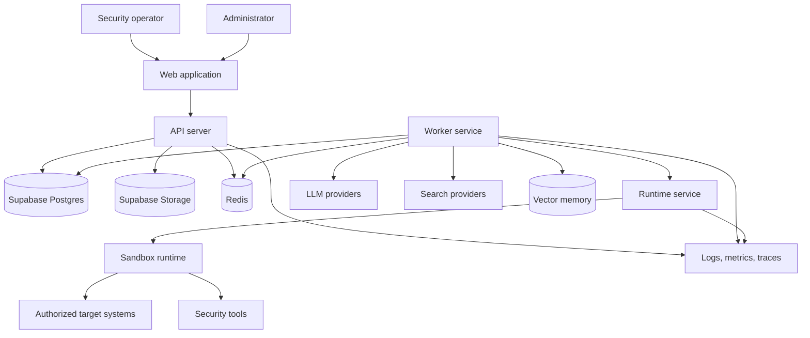

## 3. Major Components

### Web Application

Responsibilities:

- Login forms and session-aware UI state.
- Dashboard.
- Project and session management.
- Live session workspace.
- Task/step/evidence/finding review.
- File and resource management.
- Provider, policy, and user settings.
- Report editing and export.

Suggested implementation:

- React + TypeScript.
- Router-based pages.
- Typed REST client against FastAPI.
- WebSocket client for live events, terminal output, progress updates, and approval state.
- Virtualized log and terminal views.

### API Server

Responsibilities:

- Authentication.
- Backend-mediated Supabase Auth calls.
- Authorization.
- Public API contract.
- Session creation.
- Scope and policy validation.
- Database transactions.
- Realtime event fanout.
- File upload/download.
- Report export endpoints.
- API tokens and audit events.

Chosen implementation:

- Python with FastAPI.
- Sync SQLAlchemy for application database access.
- Supabase Auth integration behind backend auth routes.
- Supabase Python client only inside backend Auth and Storage adapters.
- Alembic for migrations.

The architecture should keep framework boundaries clear so internal services, workers, and runtime adapters remain testable.

### Worker Service

Responsibilities:

- Pull jobs from queue.
- Run planner/executor/reporter loops.
- Call LLM providers.
- Invoke tools through tool runtime.
- Persist job status, step results, messages, tool calls, evidence, and final outputs to Postgres.
- Emit realtime events.
- Enforce timeouts and cancellation.
- Resume or safely fail interrupted sessions.
- Treat Celery task results as non-canonical execution metadata.

### Sandbox Runtime

Responsibilities:

- Start per-session isolated execution environments.
- Execute commands.
- Read/write/list files inside the workspace.
- Enforce CPU, memory, network, and timeout limits.
- Capture stdout/stderr.
- Copy evidence out safely.
- Stop and clean up environments.

First implementation can use Docker. Later implementations can support Kubernetes jobs, Firecracker microVMs, or remote runners.

### Tool Registry

Responsibilities:

- Define all callable tools.
- Validate tool arguments.
- Run policy checks.
- Execute handlers.
- Record tool call lifecycle.
- Normalize results.

Tool categories:

- Environment tools: terminal, files, HTTP client, browser.
- Research tools: web search, exploit database search, documentation search.
- Memory tools: vector search/store, knowledge graph search.
- Workflow tools: ask user, create finding, update plan, mark done.
- Administration tools: pause, stop, request approval.

### Provider Adapter Layer

Responsibilities:

- Normalize LLM calls.
- Support streaming.
- Support tool calling.
- Track token usage.
- Track cost.
- Map agent roles to models.
- Hide provider-specific request/response differences.

Provider adapter interface:

```text
Provider.callText(input, options) -> text
Provider.callWithTools(messages, tools, options) -> model response
Provider.stream(messages, tools, options) -> event stream
Provider.embed(texts, options) -> vectors
Provider.healthCheck() -> status
```

### Policy Engine

Responsibilities:

- Evaluate whether a tool call is allowed.
- Enforce target scope.
- Enforce tool allowlist/denylist.
- Enforce approval rules.
- Enforce rate and budget limits.
- Produce policy decisions for audit.

Policy decisions:

- allow.
- deny.
- require approval.
- require user input.
- transform arguments.

### Storage Layer

Responsibilities:

- Relational state in Postgres.
- Embeddings in pgvector or dedicated vector DB.
- Large files in filesystem/S3-compatible object store.
- Event log for realtime replay or audit.

## 4. Recommended Service Layout

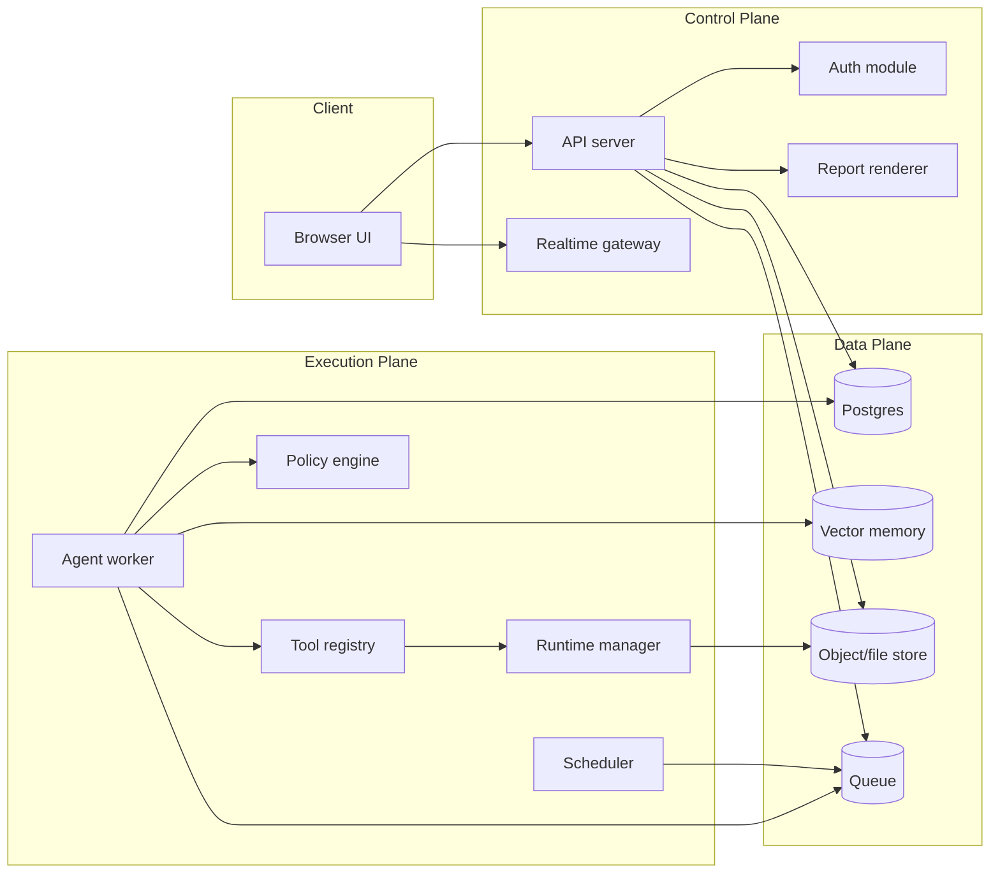

## 5. Session Execution Flow

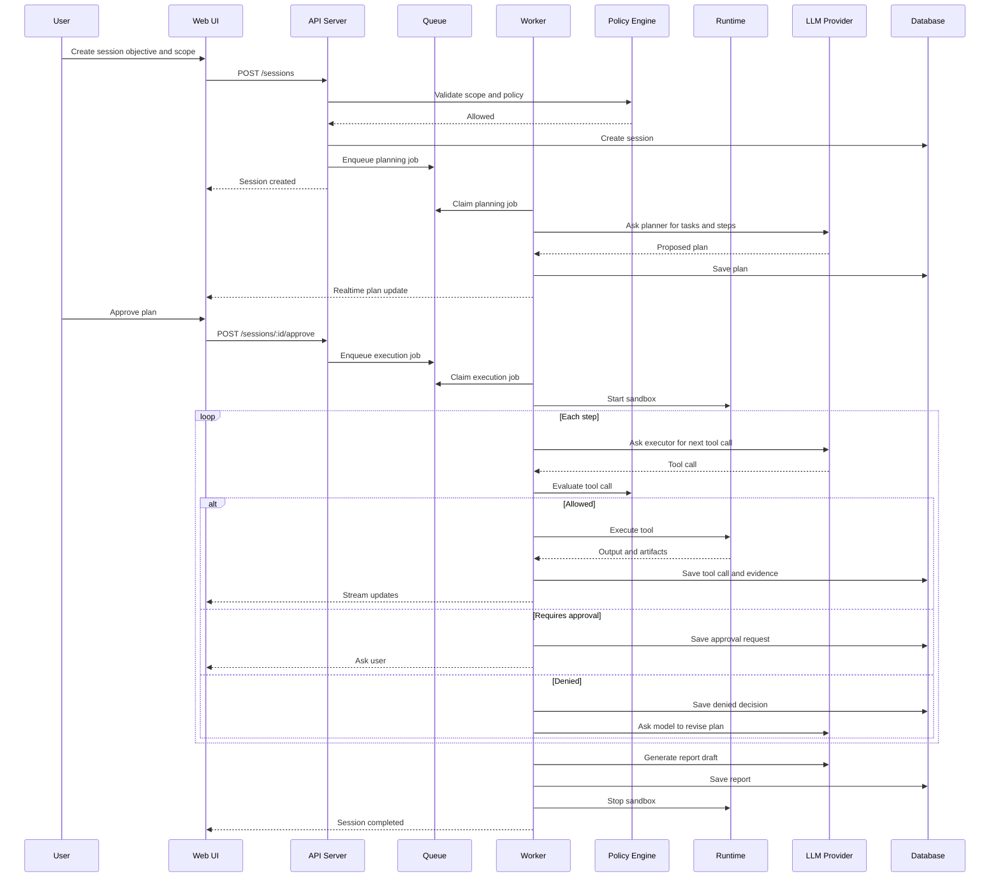

## 6. Agent Model

The system should avoid hard-coding too much agent behavior. Agents are role configurations around the same orchestration primitives.

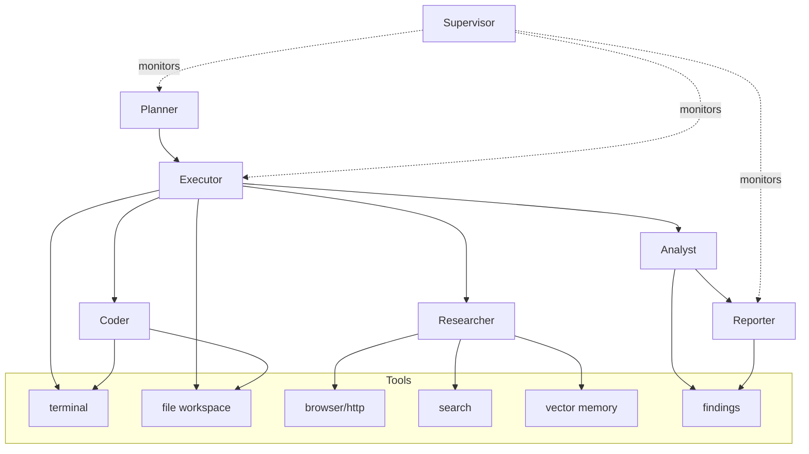

## 7. Tool Call Lifecycle

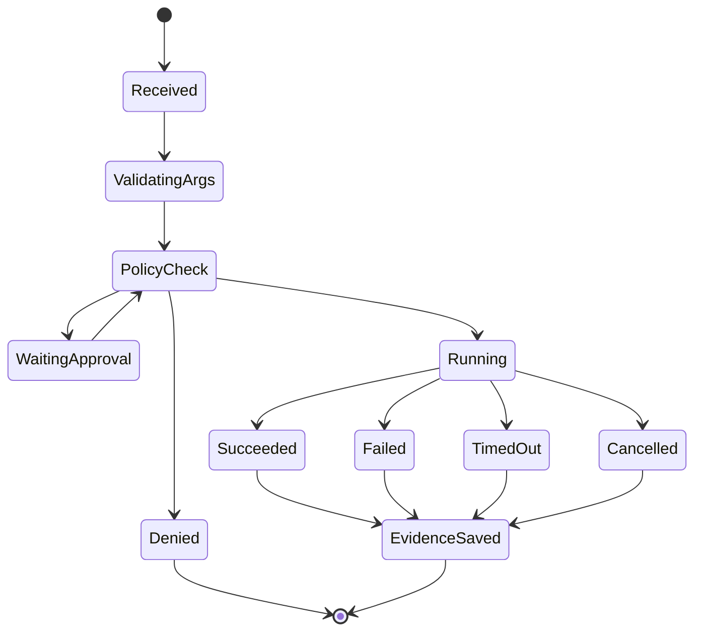

## 8. Data Model

Initial entities:

- Workspace.
- User.
- Role.
- API token.
- Project.
- Target.
- Scope.
- Provider profile.
- Policy.
- Session.
- Task.
- Step.
- Agent message.
- Tool call.
- Runtime container.
- File asset.
- Evidence.
- Finding.
- Report.
- Approval request.
- Audit event.
- Memory document.

See [Database Design](DATABASE_DESIGN.md) for the detailed table design, indexes, status enums, evidence storage, event storage, and migration strategy.

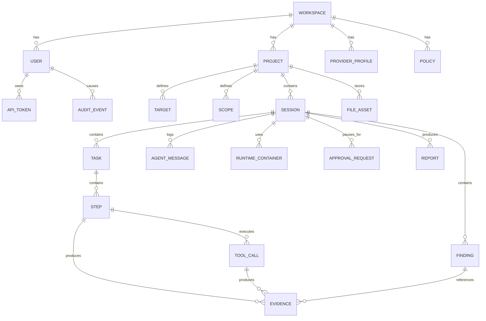

## 9. Suggested Database Tables

```text
workspaces
users
roles
role_permissions
api_tokens
projects
targets
scopes
provider_profiles
policies
sessions
tasks
steps
agent_messages
tool_calls
runtime_containers
file_assets
evidence
findings
reports
approval_requests
audit_events
memory_documents
memory_embeddings
```

Important indexes:

- `sessions(workspace_id, project_id, created_at)`
- `sessions(status)`
- `tasks(session_id, position)`
- `steps(task_id, position)`
- `tool_calls(session_id, created_at)`
- `tool_calls(status)`
- `evidence(session_id, created_at)`
- `findings(session_id, severity)`
- `audit_events(workspace_id, created_at)`
- Vector index for embeddings.

## 10. API Shape

The exact transport can be REST, GraphQL, or a hybrid. A hybrid is practical:

- REST for files, auth, downloads, exports, and health.
- GraphQL or typed RPC for rich app data.
- WebSocket for live events.

Example REST resources:

```text
POST   /api/sessions
GET    /api/sessions/:id
POST   /api/sessions/:id/start
POST   /api/sessions/:id/pause
POST   /api/sessions/:id/stop
POST   /api/sessions/:id/input
GET    /api/sessions/:id/events
GET    /api/sessions/:id/report
POST   /api/projects/:id/resources
GET    /api/files/:id/download
```

Example realtime events:

```text
session.created
session.updated
task.created
task.updated
step.started
step.updated
tool_call.started
tool_call.output
tool_call.finished
evidence.created
finding.created
approval.requested
agent.message
report.updated
```

## 11. Runtime Isolation Design

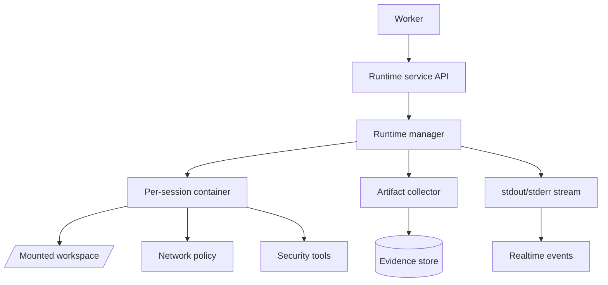

Runtime requirements:

- One workspace per session.
- No direct host filesystem access except mounted workspace.
- Docker socket access belongs to the runtime service, not the Celery worker.
- Read/write restrictions inside workspace.
- Configurable network mode.
- Command timeout.
- Max output size.
- Resource limits.
- Cleanup and retention policy.

## 12. Policy Enforcement Points

Policy should be checked at multiple layers:

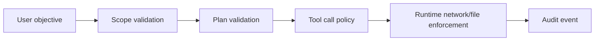

Examples:

- Reject terminal command if it targets an out-of-scope host.
- Require approval before running high-impact scans.
- Deny file write outside `/workspace`.
- Limit HTTP request rate.
- Stop session if budget exceeds threshold.
- Mask secrets in logs.

## 13. Realtime Design

Recommended approach:

- Worker writes durable events to database or event table.
- API broadcasts events to subscribed WebSocket clients.
- UI can reconnect and replay from last event ID.
- Use WebSocket from the start so the same channel can later support bidirectional terminal input, approvals, cancellation, and collaborative session state.

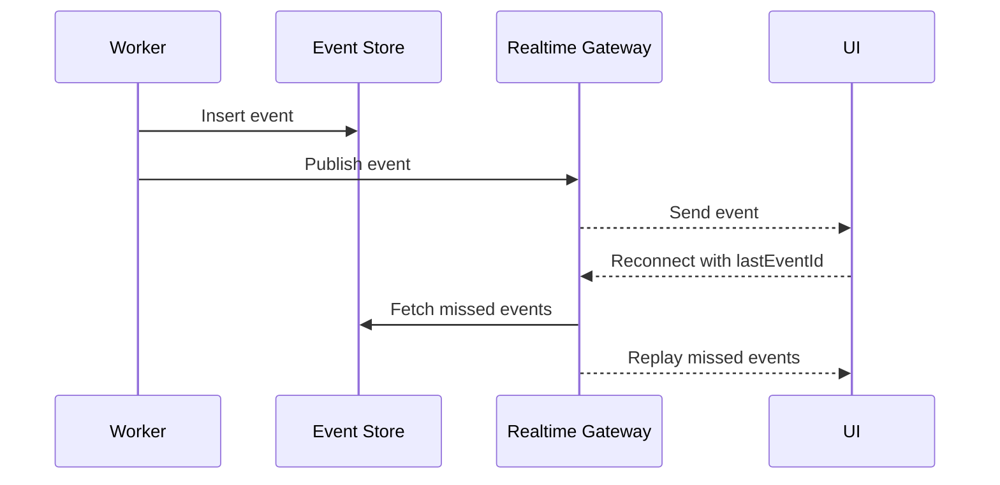

## 14. Deployment Architecture

### Initial Local Development Deployment

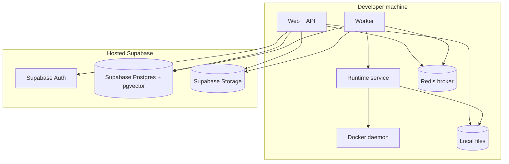

Local development should use hosted Supabase first. Docker Compose runs the application services, runtime service, and Redis locally, while Supabase Auth, Postgres, and Storage stay hosted. The runtime service owns Docker access; the worker calls the runtime service instead of mounting `/var/run/docker.sock`.

### Future Distributed Deployment

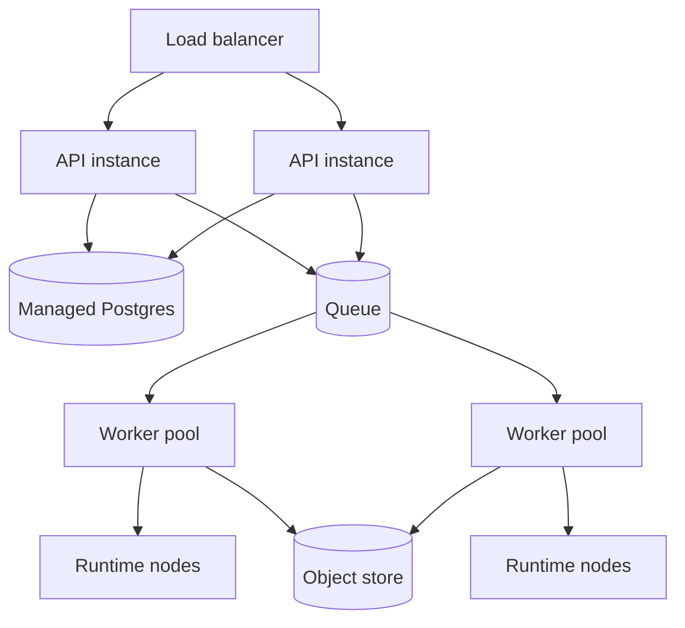

## 15. Technology Decisions

The current stack decision is documented in [Tech Stack Decision](TECH_STACK_DECISION.md).

Chosen stack:

- Backend: Python with FastAPI.
- Frontend: React + TypeScript + Vite.
- Database: Supabase Postgres with pgvector.
- Auth: Supabase Auth.
- Migrations: Alembic.
- Queue: Redis + Celery.
- Runtime: Docker first.
- Deployment: Docker Compose first.
- Realtime: FastAPI WebSocket.

The architecture should still keep strong boundaries between API, workers, runtime, storage, and policy so the implementation can evolve beyond the initial stack later.

## 16. Repository Architecture

Proposed shape:

```text
.
|-- docs/
|-- apps/
|   |-- web/
|   `-- api/
|-- services/
|   |-- runtime/
|   `-- worker/
|-- packages/
|   |-- shared/
|   |-- sdk/
|   `-- policy/
|-- infra/
|   |-- compose/
|   |-- migrations/
|   `-- observability/
`-- scripts/
```

With the chosen Python stack, `apps/api` owns the FastAPI application and shared backend modules. `services/worker` owns Celery worker entrypoints and orchestration code. Shared Python modules can be kept in a backend package if duplication appears.

## 17. Failure Handling

Critical failure cases:

- LLM provider timeout.
- Tool call timeout.
- Container crash.
- Worker process restart.
- Browser disconnect.
- Database connection loss.
- Queue duplication.
- User cancels session.

Expected behavior:

- Persist current state before long operations.
- Mark interrupted tool calls as cancelled, timed out, or unknown.
- Resume only from safe checkpoints.
- Never silently rerun high-risk commands.
- Preserve partial evidence.

## 18. Security Considerations

- Store secrets encrypted.
- Mask secrets in logs.
- Avoid sending secrets to LLMs unless explicitly allowed.
- Validate every tool argument.
- Keep policy checks outside prompts.
- Keep audit logs append-only where possible.
- Limit container capabilities.
- Disable privileged containers by default.
- Add approval gates for risky commands.
- Provide a global kill switch.

## 19. Open Architecture Questions

- Do we want a monolith first or separate API/worker services immediately?
- Should session events be stored as a first-class event table?
- Should policy be a custom engine or use something like OPA later?
- Should the runtime support browser automation from day one?
- Should vector memory be global by default, or project/session only?
- Should reports be generated by the worker or by a dedicated report service?
