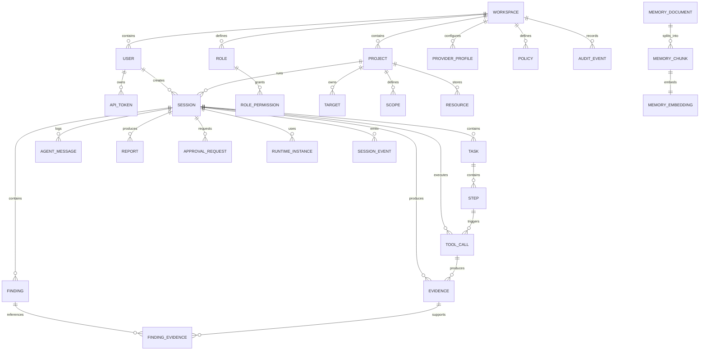
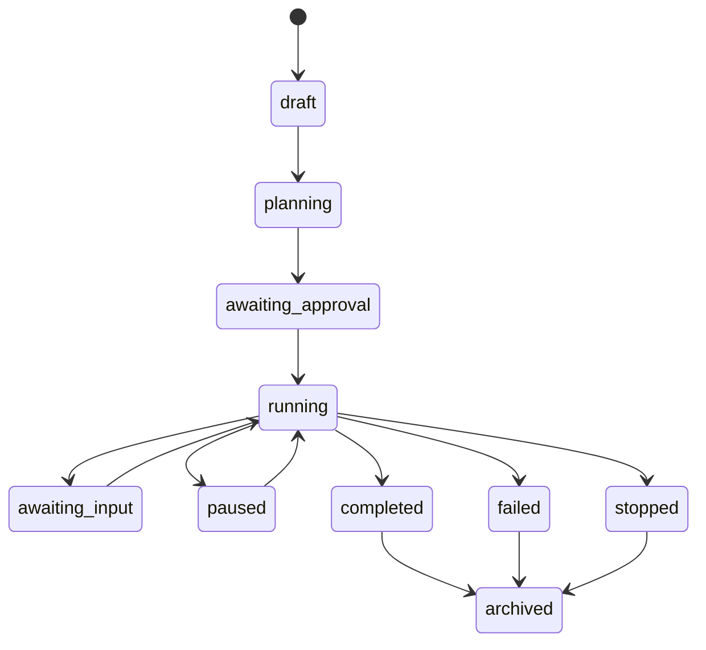
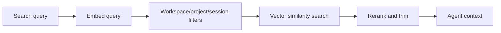
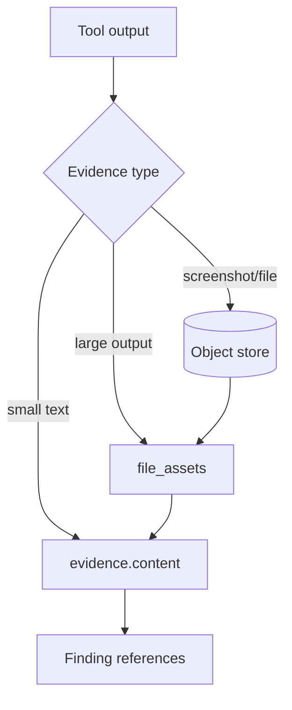
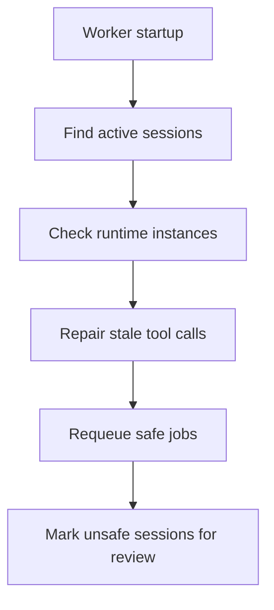
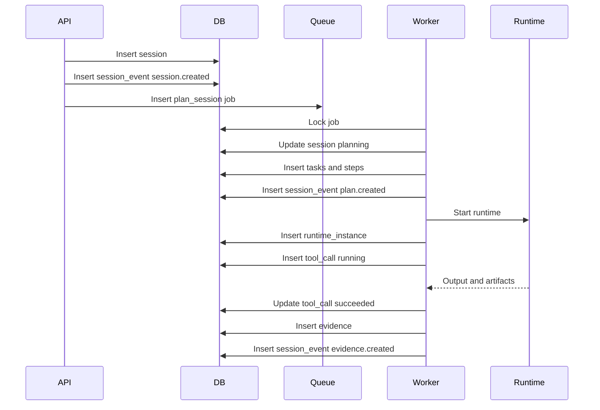

# ScopeForge Database Design

## 1. Purpose

This document defines the database design for ScopeForge. The database must preserve live execution state, long-term evidence, audit history, provider configuration, policy decisions, reports, and vector memory.

The data model should support a local single-node deployment first, but it should not block future multi-workspace, distributed worker, or enterprise deployments.

## 2. Design Goals

- Keep security testing sessions auditable from objective to report.
- Make every tool call traceable to a session, task, step, agent, policy decision, and evidence item.
- Support realtime UI updates through durable event storage.
- Keep workspace and project boundaries explicit.
- Separate raw artifacts from structured metadata.
- Support soft deletion and retention policies.
- Support vector search without mixing unrelated workspaces or projects.
- Avoid storing secrets in plaintext.
- Make migrations predictable and reviewable.

## 3. Database Technology

Chosen initial stack:

- Supabase Postgres as the primary relational database.
- pgvector for embeddings and semantic memory.
- Supabase Storage for large files and artifacts at first.
- Redis + Celery for background jobs.
- Alembic for migrations.

Supabase is Postgres underneath, which is a good fit because the product needs strong relational integrity, JSON metadata support, transactional session state, Auth integration, storage integration, and vector search.

## 4. Logical Model



## 5. Entity Groups

The schema should be split into clear ownership groups:

| Group | Tables | Purpose |
| --- | --- | --- |
| Identity | `workspaces`, `users`, `roles`, `role_permissions`, `api_tokens`, `auth_sessions` | Auth, sessions, RBAC, automation tokens |
| Configuration | `provider_profiles`, `policies`, `tool_definitions` | LLM providers, runtime rules, tool metadata |
| Project model | `projects`, `targets`, `scopes`, `resources` | Authorized assets, rules of engagement, reusable files |
| Session execution | `sessions`, `tasks`, `steps`, `agent_messages`, `tool_calls`, `runtime_instances` | Live and historical execution state |
| Review and reporting | `evidence`, `findings`, `finding_evidence`, `reports` | Findings, proof, and exports |
| Workflow control | `approval_requests`, `session_events`, `jobs` | Realtime state, human gates, background work |
| Memory | `memory_documents`, `memory_chunks`, `memory_embeddings` | Semantic knowledge and retrieval |
| Audit | `audit_events` | Security-sensitive action history |

## 6. Naming Conventions

Use predictable names:

- Tables are plural snake_case.
- Primary keys are `id`.
- Foreign keys are `{table_singular}_id`.
- Timestamps are `created_at`, `updated_at`, `deleted_at`.
- Status fields use lowercase strings or database enums.
- JSON fields end with `_json` only when the name would otherwise be ambiguous.

Recommended common columns:

```text
id uuid primary key
workspace_id uuid not null
created_at timestamptz not null default now()
updated_at timestamptz not null default now()
deleted_at timestamptz null
```

For high-volume event/log tables, use UUIDs or bigints depending on implementation preference. UUIDs simplify distributed writes; bigints can be smaller and faster in single-node deployments.

## 7. Status Enums

Statuses should be explicit and stable because they drive UI state and worker recovery.

### Session Status



Values:

```text
draft
planning
awaiting_approval
running
awaiting_input
paused
completed
failed
stopped
archived
```

### Task Status

```text
created
planned
running
blocked
completed
failed
cancelled
```

### Step Status

```text
created
ready
running
awaiting_approval
awaiting_input
completed
failed
skipped
cancelled
```

### Tool Call Status

```text
received
validating
policy_check
awaiting_approval
running
succeeded
failed
timed_out
cancelled
denied
```

### Finding Status

```text
candidate
needs_review
confirmed
false_positive
accepted_risk
fixed
archived
```

### Approval Status

```text
pending
approved
denied
expired
cancelled
```

### Runtime Status

```text
starting
running
stopping
stopped
failed
removed
```

## 8. Core Tables

The schema below is conceptual. Exact SQL can be generated later after the backend stack is chosen.

### 8.1 workspaces

Tenant or installation boundary.

| Column | Type | Notes |
| --- | --- | --- |
| `id` | uuid | Primary key |
| `name` | text | Display name |
| `slug` | text | Unique human-readable key |
| `settings` | jsonb | Workspace-level settings |
| `created_at` | timestamptz | Created time |
| `updated_at` | timestamptz | Updated time |
| `deleted_at` | timestamptz | Soft delete |

Indexes:

- unique `slug` where `deleted_at is null`.

### 8.2 users

Human or service users.

| Column | Type | Notes |
| --- | --- | --- |
| `id` | uuid | Primary key |
| `workspace_id` | uuid | FK to `workspaces` |
| `supabase_user_id` | uuid | Nullable Supabase Auth user id for human users |
| `email` | text | Login email |
| `name` | text | Display name |
| `type` | text | `human`, `service` |
| `status` | text | `active`, `blocked`, `invited` |
| `role_id` | uuid | FK to `roles` |
| `last_login_at` | timestamptz | Nullable |
| `created_at` | timestamptz | Created time |
| `updated_at` | timestamptz | Updated time |
| `deleted_at` | timestamptz | Soft delete |

Indexes:

- unique `(workspace_id, email)` where `deleted_at is null`.
- unique `(workspace_id, supabase_user_id)` where `supabase_user_id is not null and deleted_at is null`.
- `(workspace_id, role_id)`.

### 8.3 roles and role_permissions

RBAC model.

`roles`:

| Column | Type | Notes |
| --- | --- | --- |
| `id` | uuid | Primary key |
| `workspace_id` | uuid | FK to `workspaces` |
| `name` | text | Admin, Operator, Reviewer, Viewer |
| `description` | text | Optional |
| `created_at` | timestamptz | Created time |

`role_permissions`:

| Column | Type | Notes |
| --- | --- | --- |
| `id` | uuid | Primary key |
| `role_id` | uuid | FK to `roles` |
| `permission` | text | Example: `sessions.create` |

Indexes:

- unique `(workspace_id, name)`.
- unique `(role_id, permission)`.

### 8.4 api_tokens

Automation access tokens. Store only token hashes.

| Column | Type | Notes |
| --- | --- | --- |
| `id` | uuid | Primary key |
| `workspace_id` | uuid | FK to `workspaces` |
| `user_id` | uuid | Owner |
| `token_prefix` | text | Display/debug prefix |
| `token_hash` | text | Hashed secret |
| `name` | text | User label |
| `status` | text | `active`, `revoked`, `expired` |
| `expires_at` | timestamptz | Nullable |
| `last_used_at` | timestamptz | Nullable |
| `created_at` | timestamptz | Created time |
| `deleted_at` | timestamptz | Soft delete |

### 8.5 auth_sessions

Backend-owned browser sessions. Supabase Auth verifies identity, but the backend owns the application session cookie, workspace context, CSRF binding, and revocation state.

| Column | Type | Notes |
| --- | --- | --- |
| `id` | uuid | Primary key |
| `workspace_id` | uuid | FK to `workspaces` |
| `user_id` | uuid | FK to `users` |
| `session_hash` | text | Hash of opaque browser session token |
| `csrf_hash` | text | Hash of CSRF token or binding value |
| `supabase_session_id` | text | Nullable Supabase session reference |
| `encrypted_refresh_token` | text | Nullable encrypted Supabase refresh token |
| `ip_hash` | text | Nullable hashed client IP |
| `user_agent` | text | Nullable user agent summary |
| `status` | text | `active`, `revoked`, `expired` |
| `expires_at` | timestamptz | Expiration time |
| `last_seen_at` | timestamptz | Nullable |
| `created_at` | timestamptz | Created time |
| `revoked_at` | timestamptz | Nullable |

Indexes:

- `(user_id, status)`.
- `(workspace_id, status, created_at desc)`.
- unique `(session_hash)`.

## 9. Project and Scope Tables

### 9.1 projects

Logical grouping for targets, sessions, resources, and history.

| Column | Type | Notes |
| --- | --- | --- |
| `id` | uuid | Primary key |
| `workspace_id` | uuid | FK to `workspaces` |
| `name` | text | Display name |
| `description` | text | Optional |
| `status` | text | `active`, `archived` |
| `metadata` | jsonb | Custom fields |
| `created_by` | uuid | FK to `users` |
| `created_at` | timestamptz | Created time |
| `updated_at` | timestamptz | Updated time |
| `deleted_at` | timestamptz | Soft delete |

Indexes:

- `(workspace_id, created_at desc)`.
- `(workspace_id, status)`.

### 9.2 targets

Approved assets.

| Column | Type | Notes |
| --- | --- | --- |
| `id` | uuid | Primary key |
| `workspace_id` | uuid | FK to `workspaces` |
| `project_id` | uuid | FK to `projects` |
| `type` | text | `domain`, `ip`, `cidr`, `url`, `repo`, `api`, `cloud_account` |
| `value` | text | Target value |
| `label` | text | Optional |
| `metadata` | jsonb | Extra info |
| `created_at` | timestamptz | Created time |
| `deleted_at` | timestamptz | Soft delete |

Indexes:

- `(workspace_id, project_id, type)`.
- `(workspace_id, value)`.

### 9.3 scopes

Rules of engagement for a session or reusable project template.

| Column | Type | Notes |
| --- | --- | --- |
| `id` | uuid | Primary key |
| `workspace_id` | uuid | FK to `workspaces` |
| `project_id` | uuid | FK to `projects` |
| `name` | text | Display name |
| `allowed_targets` | jsonb | Domains, URLs, CIDRs, repos |
| `denied_targets` | jsonb | Explicit denylist |
| `allowed_tools` | jsonb | Tool allowlist |
| `denied_tools` | jsonb | Tool denylist |
| `rate_limits` | jsonb | Request/scan limits |
| `approval_rules` | jsonb | Human gate rules |
| `test_window` | jsonb | Allowed dates/times |
| `contacts` | jsonb | Escalation contacts |
| `created_at` | timestamptz | Created time |
| `updated_at` | timestamptz | Updated time |

Use JSONB here because scope policy will evolve quickly. Later, high-value fields can be normalized.

### 9.4 resources

Reusable user-provided files.

| Column | Type | Notes |
| --- | --- | --- |
| `id` | uuid | Primary key |
| `workspace_id` | uuid | FK to `workspaces` |
| `project_id` | uuid | Nullable FK to `projects` |
| `name` | text | File or folder name |
| `path` | text | Logical path |
| `asset_id` | uuid | FK to `file_assets` |
| `kind` | text | `file`, `directory` |
| `size_bytes` | bigint | File size |
| `content_hash` | text | For dedupe |
| `created_by` | uuid | FK to `users` |
| `created_at` | timestamptz | Created time |
| `updated_at` | timestamptz | Updated time |
| `deleted_at` | timestamptz | Soft delete |

## 10. Provider and Policy Tables

### 10.1 provider_profiles

LLM and embedding provider settings.

| Column | Type | Notes |
| --- | --- | --- |
| `id` | uuid | Primary key |
| `workspace_id` | uuid | FK to `workspaces` |
| `name` | text | Display name |
| `provider_type` | text | `openai`, `anthropic`, `ollama`, `custom`, etc. |
| `base_url` | text | Nullable |
| `credential_ref` | text | Secret vault reference, not raw key |
| `agent_models` | jsonb | Model per agent role |
| `options` | jsonb | Temperature, max tokens, reasoning, etc. |
| `budgets` | jsonb | Cost/token limits |
| `status` | text | `active`, `disabled` |
| `created_at` | timestamptz | Created time |
| `updated_at` | timestamptz | Updated time |
| `deleted_at` | timestamptz | Soft delete |

Indexes:

- unique `(workspace_id, name)` where `deleted_at is null`.
- `(workspace_id, provider_type)`.

### 10.2 policies

Reusable execution policies.

| Column | Type | Notes |
| --- | --- | --- |
| `id` | uuid | Primary key |
| `workspace_id` | uuid | FK to `workspaces` |
| `name` | text | Display name |
| `description` | text | Optional |
| `rules` | jsonb | Policy rules |
| `status` | text | `active`, `disabled` |
| `created_at` | timestamptz | Created time |
| `updated_at` | timestamptz | Updated time |

### 10.3 tool_definitions

Catalog of built-in and plugin tools.

| Column | Type | Notes |
| --- | --- | --- |
| `id` | uuid | Primary key |
| `workspace_id` | uuid | Nullable for system tools |
| `name` | text | Tool name |
| `version` | text | Tool version |
| `description` | text | Human description |
| `input_schema` | jsonb | JSON schema |
| `output_schema` | jsonb | JSON schema |
| `risk_level` | text | `low`, `medium`, `high`, `critical` |
| `runtime_type` | text | `builtin`, `http`, `container`, `remote` |
| `default_timeout_seconds` | integer | Tool default |
| `status` | text | `active`, `disabled` |
| `created_at` | timestamptz | Created time |

## 11. Session Execution Tables

### 11.1 sessions

Top-level execution run.

| Column | Type | Notes |
| --- | --- | --- |
| `id` | uuid | Primary key |
| `workspace_id` | uuid | FK to `workspaces` |
| `project_id` | uuid | FK to `projects` |
| `scope_id` | uuid | FK to `scopes` |
| `provider_profile_id` | uuid | FK to `provider_profiles` |
| `policy_id` | uuid | FK to `policies` |
| `created_by` | uuid | FK to `users` |
| `title` | text | Generated or user-provided |
| `objective` | text | User objective |
| `status` | text | Session status |
| `mode` | text | `autonomous`, `assisted`, `manual` |
| `summary` | text | Current summary |
| `metadata` | jsonb | Misc details |
| `started_at` | timestamptz | Nullable |
| `completed_at` | timestamptz | Nullable |
| `created_at` | timestamptz | Created time |
| `updated_at` | timestamptz | Updated time |
| `deleted_at` | timestamptz | Soft delete |

Indexes:

- `(workspace_id, project_id, created_at desc)`.
- `(workspace_id, status)`.
- `(workspace_id, created_by, created_at desc)`.

### 11.2 tasks

Major phase in a session.

| Column | Type | Notes |
| --- | --- | --- |
| `id` | uuid | Primary key |
| `workspace_id` | uuid | FK to `workspaces` |
| `session_id` | uuid | FK to `sessions` |
| `title` | text | Task title |
| `description` | text | Task details |
| `status` | text | Task status |
| `position` | integer | Ordered task position |
| `result_summary` | text | Final task summary |
| `created_at` | timestamptz | Created time |
| `updated_at` | timestamptz | Updated time |

Indexes:

- `(session_id, position)`.
- `(workspace_id, status)`.

### 11.3 steps

Concrete executable unit.

| Column | Type | Notes |
| --- | --- | --- |
| `id` | uuid | Primary key |
| `workspace_id` | uuid | FK to `workspaces` |
| `session_id` | uuid | FK to `sessions` |
| `task_id` | uuid | FK to `tasks` |
| `title` | text | Step title |
| `description` | text | Step details |
| `status` | text | Step status |
| `agent_role` | text | Planner, executor, researcher, etc. |
| `position` | integer | Ordered step position |
| `input` | text | Step input |
| `result` | text | Step result |
| `started_at` | timestamptz | Nullable |
| `completed_at` | timestamptz | Nullable |
| `created_at` | timestamptz | Created time |
| `updated_at` | timestamptz | Updated time |

Indexes:

- `(task_id, position)`.
- `(session_id, status)`.

### 11.4 agent_messages

Conversation and reasoning log. Store safe, useful content; avoid raw hidden chain-of-thought if a provider treats it as private. Use summaries and visible model output.

| Column | Type | Notes |
| --- | --- | --- |
| `id` | uuid | Primary key |
| `workspace_id` | uuid | FK to `workspaces` |
| `session_id` | uuid | FK to `sessions` |
| `task_id` | uuid | Nullable FK |
| `step_id` | uuid | Nullable FK |
| `agent_role` | text | Agent role |
| `message_type` | text | `system`, `user`, `assistant`, `tool`, `summary` |
| `content` | text | Message content |
| `metadata` | jsonb | Model, stream id, etc. |
| `token_input` | integer | Nullable |
| `token_output` | integer | Nullable |
| `cost_input` | numeric | Nullable |
| `cost_output` | numeric | Nullable |
| `created_at` | timestamptz | Created time |

Indexes:

- `(session_id, created_at)`.
- `(session_id, agent_role, created_at)`.

### 11.5 tool_calls

Every tool invocation.

| Column | Type | Notes |
| --- | --- | --- |
| `id` | uuid | Primary key |
| `workspace_id` | uuid | FK to `workspaces` |
| `session_id` | uuid | FK to `sessions` |
| `task_id` | uuid | Nullable FK |
| `step_id` | uuid | Nullable FK |
| `agent_message_id` | uuid | Nullable FK |
| `tool_name` | text | Tool name |
| `tool_version` | text | Nullable |
| `status` | text | Tool call status |
| `arguments` | jsonb | Validated args |
| `result` | jsonb | Structured result |
| `raw_output` | text | Optional truncated output |
| `error_message` | text | Nullable |
| `policy_decision` | jsonb | Policy result |
| `started_at` | timestamptz | Nullable |
| `completed_at` | timestamptz | Nullable |
| `duration_ms` | integer | Nullable |
| `created_at` | timestamptz | Created time |
| `updated_at` | timestamptz | Updated time |

Indexes:

- `(session_id, created_at)`.
- `(session_id, status)`.
- `(tool_name, created_at desc)`.
- GIN index on `arguments` for selective querying later if needed.

### 11.6 runtime_instances

Sandbox containers or remote runtime sessions.

| Column | Type | Notes |
| --- | --- | --- |
| `id` | uuid | Primary key |
| `workspace_id` | uuid | FK to `workspaces` |
| `session_id` | uuid | FK to `sessions` |
| `runtime_type` | text | `docker`, `kubernetes`, `remote` |
| `status` | text | Runtime status |
| `image` | text | Container image or runtime image |
| `external_id` | text | Docker container id, pod id, etc. |
| `workspace_path` | text | Logical path |
| `ports` | jsonb | Exposed/mapped ports |
| `resource_limits` | jsonb | CPU, memory, timeout |
| `started_at` | timestamptz | Nullable |
| `stopped_at` | timestamptz | Nullable |
| `created_at` | timestamptz | Created time |
| `updated_at` | timestamptz | Updated time |

## 12. Evidence and Reporting Tables

### 12.1 file_assets

Physical files and object store references.

| Column | Type | Notes |
| --- | --- | --- |
| `id` | uuid | Primary key |
| `workspace_id` | uuid | FK to `workspaces` |
| `storage_backend` | text | `local`, `s3`, `gcs`, etc. |
| `storage_key` | text | Object key/path |
| `filename` | text | Original/display filename |
| `mime_type` | text | Nullable |
| `size_bytes` | bigint | File size |
| `sha256` | text | Content hash |
| `metadata` | jsonb | Extra fields |
| `created_by` | uuid | Nullable FK to `users` |
| `created_at` | timestamptz | Created time |
| `deleted_at` | timestamptz | Soft delete |

Indexes:

- `(workspace_id, sha256)`.
- `(workspace_id, created_at desc)`.

### 12.2 evidence

Structured proof artifacts.

| Column | Type | Notes |
| --- | --- | --- |
| `id` | uuid | Primary key |
| `workspace_id` | uuid | FK to `workspaces` |
| `project_id` | uuid | FK to `projects` |
| `session_id` | uuid | FK to `sessions` |
| `task_id` | uuid | Nullable FK |
| `step_id` | uuid | Nullable FK |
| `tool_call_id` | uuid | Nullable FK |
| `type` | text | `terminal`, `http`, `screenshot`, `file`, `note`, `search`, `finding_data` |
| `title` | text | Display title |
| `summary` | text | Human-readable summary |
| `content` | text | Optional textual evidence |
| `asset_id` | uuid | Nullable FK to `file_assets` |
| `metadata` | jsonb | Request/response, command, target, etc. |
| `created_by_agent` | boolean | Agent generated |
| `created_at` | timestamptz | Created time |

Indexes:

- `(session_id, created_at)`.
- `(session_id, type)`.
- `(tool_call_id)`.

### 12.3 findings

Reviewed or candidate issues.

| Column | Type | Notes |
| --- | --- | --- |
| `id` | uuid | Primary key |
| `workspace_id` | uuid | FK to `workspaces` |
| `project_id` | uuid | FK to `projects` |
| `session_id` | uuid | FK to `sessions` |
| `title` | text | Finding title |
| `status` | text | Finding status |
| `severity` | text | `info`, `low`, `medium`, `high`, `critical` |
| `confidence` | text | `low`, `medium`, `high` |
| `affected_assets` | jsonb | URLs, hosts, paths, accounts |
| `description` | text | Finding detail |
| `impact` | text | Impact |
| `reproduction_steps` | text | Steps |
| `remediation` | text | Fix guidance |
| `references` | jsonb | Links/CVEs/CWEs |
| `created_by_agent` | boolean | Candidate source |
| `reviewed_by` | uuid | Nullable FK to `users` |
| `created_at` | timestamptz | Created time |
| `updated_at` | timestamptz | Updated time |
| `deleted_at` | timestamptz | Soft delete |

Indexes:

- `(session_id, severity)`.
- `(project_id, status)`.
- `(workspace_id, created_at desc)`.

### 12.4 finding_evidence

Many-to-many relationship.

| Column | Type | Notes |
| --- | --- | --- |
| `finding_id` | uuid | FK to `findings` |
| `evidence_id` | uuid | FK to `evidence` |
| `relationship` | text | `primary`, `supporting`, `context` |
| `created_at` | timestamptz | Created time |

Primary key:

- `(finding_id, evidence_id)`.

### 12.5 reports

Report snapshots and exports.

| Column | Type | Notes |
| --- | --- | --- |
| `id` | uuid | Primary key |
| `workspace_id` | uuid | FK to `workspaces` |
| `project_id` | uuid | FK to `projects` |
| `session_id` | uuid | FK to `sessions` |
| `title` | text | Report title |
| `status` | text | `draft`, `reviewed`, `final`, `archived` |
| `format` | text | `web`, `markdown`, `pdf`, `json` |
| `content` | jsonb | Structured report data |
| `asset_id` | uuid | Nullable exported file |
| `created_by` | uuid | Nullable FK to `users` |
| `created_at` | timestamptz | Created time |
| `updated_at` | timestamptz | Updated time |

## 13. Workflow Control Tables

### 13.1 approval_requests

Human approval gates.

| Column | Type | Notes |
| --- | --- | --- |
| `id` | uuid | Primary key |
| `workspace_id` | uuid | FK to `workspaces` |
| `session_id` | uuid | FK to `sessions` |
| `task_id` | uuid | Nullable FK |
| `step_id` | uuid | Nullable FK |
| `tool_call_id` | uuid | Nullable FK |
| `status` | text | Approval status |
| `risk_level` | text | `low`, `medium`, `high`, `critical` |
| `reason` | text | Why approval is needed |
| `requested_action` | jsonb | Command/tool/request details |
| `requested_by_agent` | text | Agent role |
| `resolved_by` | uuid | Nullable FK to `users` |
| `resolution_note` | text | Nullable |
| `expires_at` | timestamptz | Nullable |
| `created_at` | timestamptz | Created time |
| `resolved_at` | timestamptz | Nullable |

Indexes:

- `(session_id, status)`.
- `(workspace_id, status, created_at)`.

### 13.2 session_events

Durable realtime event stream.

| Column | Type | Notes |
| --- | --- | --- |
| `id` | bigserial or uuid | Event id |
| `workspace_id` | uuid | FK to `workspaces` |
| `session_id` | uuid | FK to `sessions` |
| `event_type` | text | Example: `tool_call.started` |
| `payload` | jsonb | Event body |
| `actor_type` | text | `user`, `agent`, `system` |
| `actor_id` | text | User id or agent role |
| `created_at` | timestamptz | Created time |

Indexes:

- `(session_id, id)`.
- `(workspace_id, created_at desc)`.
- `(event_type, created_at desc)`.

Event retention can be shorter than core audit/event history if needed, but enough should remain for replay.

### 13.3 jobs

Application-owned job ledger for background work state.

Redis + Celery delivers work to workers, but this table is the product source of truth for job status, progress, retries, errors, and small result metadata. Large outputs should live in domain tables such as `tasks`, `steps`, `tool_calls`, `evidence`, `reports`, and storage-backed artifacts.

| Column | Type | Notes |
| --- | --- | --- |
| `id` | uuid | Primary key |
| `workspace_id` | uuid | FK to `workspaces` |
| `session_id` | uuid | Nullable FK |
| `type` | text | `plan_session`, `run_session`, `render_report`, etc. |
| `status` | text | `queued`, `running`, `succeeded`, `failed`, `cancelled` |
| `payload` | jsonb | Job body |
| `celery_task_id` | text | Nullable Celery task id for correlation only |
| `attempts` | integer | Attempt count |
| `max_attempts` | integer | Retry limit |
| `progress` | jsonb | Nullable structured progress snapshot |
| `result` | jsonb | Nullable small result metadata or domain object references |
| `locked_by` | text | Worker id |
| `locked_at` | timestamptz | Nullable |
| `run_after` | timestamptz | Scheduled time |
| `last_error` | text | Nullable |
| `started_at` | timestamptz | Nullable start time |
| `finished_at` | timestamptz | Nullable finish time |
| `created_at` | timestamptz | Created time |
| `updated_at` | timestamptz | Updated time |

Indexes:

- `(status, run_after)`.
- `(locked_by, locked_at)`.
- `(session_id, created_at)`.
- `(celery_task_id)`, unique where not null.

Rules:

- Celery results should not be used as durable product state.
- Workers must update `jobs` and related domain tables during execution.
- Redis can be flushed without losing historical job state.
- Job rows should keep small status and correlation data; large logs, artifacts, reports, and evidence belong in their dedicated tables.

## 14. Memory and Vector Tables

Memory should be scoped and reviewable. Do not put all embeddings into one undifferentiated global collection.

### 14.1 memory_documents

Source document or knowledge item.

| Column | Type | Notes |
| --- | --- | --- |
| `id` | uuid | Primary key |
| `workspace_id` | uuid | FK to `workspaces` |
| `project_id` | uuid | Nullable FK |
| `session_id` | uuid | Nullable FK |
| `source_type` | text | `manual`, `agent`, `report`, `tool_output`, `resource` |
| `doc_type` | text | `answer`, `guide`, `code`, `finding`, `target_note` |
| `title` | text | Title/question |
| `content` | text | Full content or summary |
| `metadata` | jsonb | Source references |
| `review_status` | text | `unreviewed`, `approved`, `rejected` |
| `created_by` | uuid | Nullable FK to `users` |
| `created_at` | timestamptz | Created time |
| `deleted_at` | timestamptz | Soft delete |

### 14.2 memory_chunks

Chunked searchable text.

| Column | Type | Notes |
| --- | --- | --- |
| `id` | uuid | Primary key |
| `workspace_id` | uuid | FK to `workspaces` |
| `document_id` | uuid | FK to `memory_documents` |
| `chunk_index` | integer | Ordered chunk |
| `content` | text | Chunk text |
| `token_count` | integer | Nullable |
| `metadata` | jsonb | Chunk metadata |
| `created_at` | timestamptz | Created time |

### 14.3 memory_embeddings

Vector representation.

| Column | Type | Notes |
| --- | --- | --- |
| `chunk_id` | uuid | Primary key, FK to `memory_chunks` |
| `workspace_id` | uuid | FK to `workspaces` |
| `embedding_model` | text | Model name |
| `embedding_provider` | text | Provider name |
| `embedding` | vector | pgvector type |
| `created_at` | timestamptz | Created time |

Indexes:

- Vector index on `embedding`.
- `(workspace_id, embedding_model)`.
- `(workspace_id, chunk_id)`.

Memory retrieval should always filter by:

- workspace.
- allowed project/session/global visibility.
- review status.
- document type.



## 15. Audit Events

Audit events are security-sensitive and should be append-only at the application level.

### audit_events

| Column | Type | Notes |
| --- | --- | --- |
| `id` | uuid | Primary key |
| `workspace_id` | uuid | FK to `workspaces` |
| `actor_type` | text | `user`, `api_token`, `agent`, `system` |
| `actor_id` | text | User id, token id, or agent role |
| `action` | text | Example: `session.stop` |
| `resource_type` | text | Example: `session` |
| `resource_id` | text | Resource id |
| `ip_address` | inet | Nullable |
| `user_agent` | text | Nullable |
| `before` | jsonb | Nullable |
| `after` | jsonb | Nullable |
| `metadata` | jsonb | Extra fields |
| `created_at` | timestamptz | Created time |

Indexes:

- `(workspace_id, created_at desc)`.
- `(workspace_id, action, created_at desc)`.
- `(resource_type, resource_id, created_at desc)`.

Examples of audited actions:

- User login/logout.
- Provider profile created/updated/deleted.
- Scope changed.
- Session started/stopped.
- Approval approved/denied.
- Tool policy denied.
- Report finalized.
- API token created/revoked.
- Secret reference granted to session.

## 16. Evidence Storage Strategy

Store metadata in Postgres and large content in object storage.



Guidelines:

- Keep small text evidence directly in `evidence.content`.
- Put large terminal logs, screenshots, downloads, archives, and generated reports in object storage.
- Store SHA-256 for every file asset.
- Preserve original filename and MIME type.
- Link evidence to the tool call that produced it.
- Never rely only on generated prose for findings.

## 17. Realtime Event Strategy

The UI needs live updates, but durable state must remain in tables.

Use `session_events` for:

- Reconnect replay.
- Timeline view.
- Debugging worker behavior.
- Lightweight activity feed.

Do not use `session_events` as the only source of truth for sessions, tasks, tool calls, findings, or evidence.

Event examples:

```json
{
  "event_type": "tool_call.output",
  "payload": {
    "tool_call_id": "uuid",
    "stream": "stdout",
    "text": "partial output"
  }
}
```

## 18. Multi-Tenancy and Access Boundaries

Every tenant-owned table should include `workspace_id`.

Recommended query rule:

```text
Every request-scoped query must filter by workspace_id before resource id.
```

Example:

```sql
select *
from sessions
where workspace_id = $1
  and id = $2
  and deleted_at is null;
```

For project-scoped resources, also filter by `project_id` when available.

## 19. Deletion and Retention

Use soft deletion for:

- Projects.
- Sessions.
- Resources.
- Findings.
- Provider profiles.
- File assets.

Hard deletion may be allowed for:

- Expired API tokens after retention period.
- Temporary session events after replay retention.
- Runtime instances after cleanup.
- Memory embeddings when source memory document is deleted.

Retention policy should define:

- How long raw terminal logs are kept.
- How long screenshots are kept.
- How long session events are kept.
- Whether audit events are immutable and retained longer.
- Whether deleted project data is purged after a waiting period.

## 20. Secret Storage

Do not store raw provider keys, passwords, or target credentials in ordinary tables.

Use one of:

- External secret manager.
- Encrypted secrets table.
- Environment-backed references for local deployment.

Database tables should store `credential_ref`, not raw secret values.

If an encrypted secrets table is used:

| Column | Type | Notes |
| --- | --- | --- |
| `id` | uuid | Primary key |
| `workspace_id` | uuid | FK to `workspaces` |
| `name` | text | Display name |
| `secret_type` | text | `provider_key`, `target_credential`, etc. |
| `ciphertext` | bytea | Encrypted payload |
| `key_id` | text | KMS/local key id |
| `created_by` | uuid | FK to `users` |
| `created_at` | timestamptz | Created time |
| `deleted_at` | timestamptz | Soft delete |

## 21. Index Strategy

General principles:

- Index every foreign key used in joins.
- Index every high-volume status field used by workers.
- Index timeline queries by `(parent_id, created_at)`.
- Use partial indexes for soft-deleted records.
- Use GIN indexes only where JSONB filtering is frequent.
- Add vector indexes after embedding dimension is fixed.

High-value indexes:

```text
sessions(workspace_id, project_id, created_at desc) where deleted_at is null
sessions(workspace_id, status)
tasks(session_id, position)
steps(task_id, position)
steps(session_id, status)
tool_calls(session_id, created_at)
tool_calls(session_id, status)
evidence(session_id, created_at)
findings(project_id, status)
findings(session_id, severity)
approval_requests(workspace_id, status, created_at)
session_events(session_id, id)
jobs(status, run_after)
audit_events(workspace_id, created_at desc)
```

## 22. Worker Recovery Queries

The worker needs efficient queries for restart recovery.

Examples:

- Find sessions in `planning`, `running`, `awaiting_input`, `awaiting_approval`, or `paused`.
- Find running tool calls older than their timeout.
- Find runtime instances marked running but missing heartbeat.
- Find queued jobs ready for execution.
- Find approval requests that expired.



## 23. Migration Strategy

Migrations will use Alembic with SQLAlchemy models and explicit migration scripts.

Initial development migrations should target the hosted Supabase Postgres database. A local Supabase stack is optional later, but it is not required for the first developer loop.

Recommended rules:

- One migration per feature.
- Never edit applied migrations.
- Include rollback where practical.
- Keep enum changes explicit.
- Backfill data in batches.
- Add indexes concurrently in production later.
- Generate schema docs after major changes.

## 24. Code Generation Strategy

Chosen path for ScopeForge:

- Use sync SQLAlchemy 2.x models and Alembic.
- Keep complex analytics queries as SQL views or hand-written query modules.
- Use Supabase Auth for identity behind backend auth routes, but keep application authorization in the backend.
- Use the Supabase Python client for Auth and Storage adapters only.
- Use SQLAlchemy for application database access.
- Do not use Supabase table helpers for application tables.
- Use Supabase Storage through a backend-owned storage adapter.

## 25. Example Session Write Path



## 26. Open Questions

- Should primary keys be UUIDs everywhere, or bigints for high-volume logs?
- Should session events be retained forever or compacted after report finalization?
- Should `agent_messages` store full provider payloads, or only normalized visible content?
- Should tool stdout/stderr stream chunks live in `session_events`, a separate `tool_call_output_chunks` table, or object storage?
- Should policy rules stay JSONB initially or become normalized tables sooner?
- Should memory be per workspace by default, or require explicit promotion from session to project/global memory?
- Which backend stack will determine migrations and code generation?
