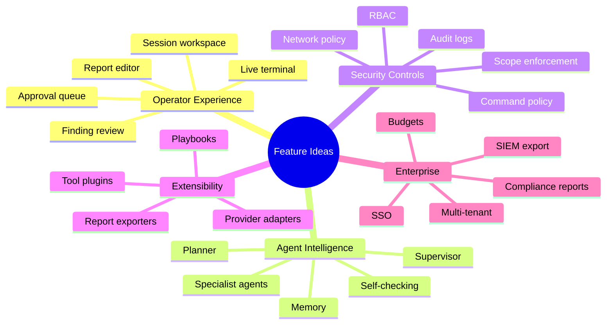
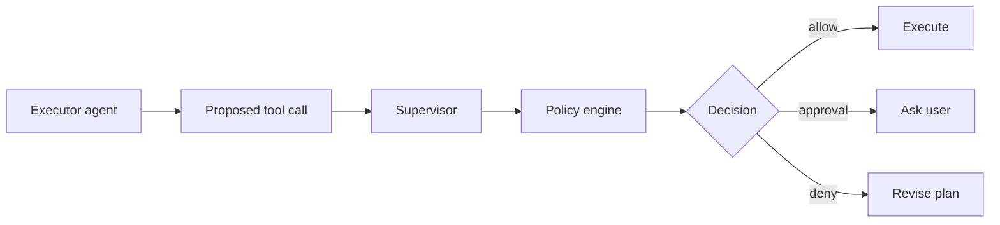
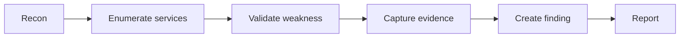
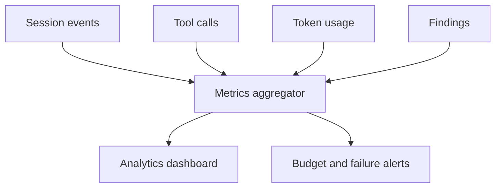
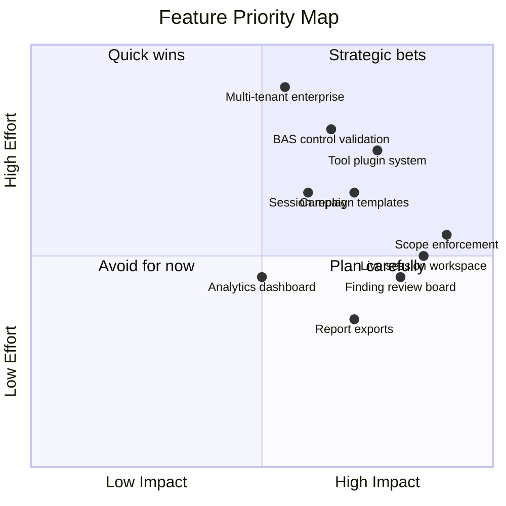

# ScopeForge Feature Ideas

This document collects feature ideas for ScopeForge. It is intentionally broader than the first build. We can later split this into a roadmap, MVP plan, and release milestones.

## 1. Feature Principles

Prioritize features that improve:

- Operator control.
- Evidence quality.
- Safety and scope enforcement.
- Repeatability.
- Report usefulness.
- Extensibility.

Avoid features that create opaque automation without review. This product should make security work more capable and auditable, not less accountable.

## 2. Core Feature Areas

## 3. Operator Experience

### Session Workspace

A central page for a running session.

Panels:

- Objective and scope.
- Current plan.
- Agent messages.
- Terminal output.
- Tool calls.
- Evidence.
- Files.
- Findings.
- Report draft.

Ideas:

- Split-pane layout for desktop.
- Mobile tab layout.
- Timeline view.
- "What is happening now?" summary.
- One-click stop/pause.
- Step-by-step replay.

### Approval Queue

Risky actions should pause for approval.

Examples:

- High-rate scan.
- Authenticated test.
- Exploit validation.
- Destructive command.
- Outbound callback setup.
- Accessing sensitive files.

Approval details:

- Proposed action.
- Reason.
- Target.
- Risk level.
- Policy that triggered approval.
- Exact command or request.
- Allow once, allow for session, deny, edit.

### Finding Review Board

Candidate findings created by agents should require human review.

Features:

- Candidate/confirmed/false positive status.
- Severity editor.
- Evidence picker.
- Reproduction step editor.
- Remediation guidance editor.
- Duplicate detection.
- Affected asset grouping.

### Report Builder

Report editing should be built into the product rather than only exporting raw agent output.

Features:

- Web report editor.
- Markdown export.
- PDF export.
- JSON export.
- Executive summary generation.
- Finding appendix.
- Evidence appendix.
- Timeline appendix.
- Export templates.

### Session Replay

A replay mode that reconstructs:

- Agent messages.
- Tool calls.
- Terminal output.
- Evidence creation.
- Finding updates.

Useful for audits, debugging agent behavior, and teaching.

## 4. Agent Intelligence

### Planner Agent

Creates a plan from objective and scope.

Possible improvements:

- Plan confidence score.
- Plan risk labels.
- Alternative plans.
- Human-editable plan before execution.
- Template-aware planning.

### Supervisor Agent

Monitors agent quality and safety.

Responsibilities:

- Detect loops.
- Detect repeated failing tool calls.
- Detect out-of-scope intent.
- Detect low-quality evidence.
- Detect missing report fields.
- Ask for human help when uncertain.

### Specialist Agents

Potential roles:

- Recon specialist.
- Web app specialist.
- API specialist.
- Cloud specialist.
- Code review specialist.
- Exploit research specialist.
- Report specialist.
- Remediation specialist.

Each role should have:

- Prompt profile.
- Tool access profile.
- Model profile.
- Budget profile.

### Memory

Memory can become a differentiator if designed carefully.

Ideas:

- Project facts.
- Target notes.
- Tool usage recipes.
- Past finding patterns.
- Approved remediation language.
- Organization-specific testing rules.

Controls:

- Manual review before global memory.
- Source references.
- Expiration.
- Delete by project/session.
- Secret detection before storing.

### Agent Evaluation Harness

A test harness for prompts and tools.

Features:

- Run sample objectives.
- Mock tools.
- Compare model providers.
- Score plan quality.
- Score report quality.
- Detect regressions after prompt changes.

## 5. Campaign and BAS-Like Features

These are not required for a basic agentic pentesting tool, but they could make ScopeForge more differentiated.

### Campaign Templates

Repeatable security validation campaigns.

Examples:

- External recon.
- Web app baseline.
- API authentication review.
- Cloud storage exposure check.
- Internal service exposure review.
- Phishing-resistant control validation, defensive only.

Template fields:

- Required inputs.
- Scope rules.
- Default tools.
- Approval gates.
- Expected evidence.
- Report sections.

### Attack Chain Builder

A visual planner for chained steps.

### Control Validation

Defensive validation focused on whether security controls catch benign simulations.

Examples:

- Can monitoring detect a port scan?
- Does WAF block a known harmless test payload?
- Are exposed admin panels detected?
- Are risky headers present?

This should avoid stealth, persistence, or malware behavior.

### Rules of Engagement Engine

A structured ROE form:

- Test windows.
- Contacts.
- Emergency stop process.
- Allowed test types.
- Disallowed actions.
- Data handling rules.
- Notification requirements.

Agents and policy checks should read from this structure.

## 6. Tooling Features

### Tool Plugin System

Allow custom tools without editing core worker logic.

Plugin metadata:

- Name.
- Description.
- Input schema.
- Output schema.
- Required permissions.
- Runtime mode.
- Timeout.
- Network needs.

Plugin execution options:

- In-process trusted tools.
- HTTP tools.
- Containerized tools.
- Remote runner tools.

### Built-In Tool Ideas

Environment:

- Terminal.
- File manager.
- HTTP client.
- Browser fetch.
- Screenshot.
- Archive extraction.

Security:

- Nmap wrapper.
- Nuclei wrapper.
- SSL/TLS checker.
- DNS recon.
- HTTP header analyzer.
- API schema tester.
- Dependency advisory lookup.

Research:

- Web search.
- Exploit database search.
- CVE lookup.
- Vendor advisory lookup.
- Documentation search.

Workflow:

- Ask user.
- Create finding.
- Attach evidence.
- Request approval.
- Update plan.
- Mark complete.

### Tool Result Normalization

Raw terminal output is useful but hard to report. The platform should normalize tool results:

- Command.
- Target.
- Summary.
- Structured findings.
- Raw output.
- Artifacts.
- Exit code.
- Duration.

## 7. Safety and Policy Features

### Scope Enforcement

Validate targets before execution:

- Domains.
- URLs.
- IP ranges.
- Ports.
- Repos.
- Cloud accounts.

Tool calls should be blocked or paused if they cannot be confidently mapped to scope.

### Command Classifier

Classify commands before execution:

- Read-only.
- Discovery.
- Active scan.
- Authentication attempt.
- Exploit validation.
- Destructive.
- Unknown.

Policy can then decide:

- Allow.
- Require approval.
- Deny.

### Network Guard

Possible controls:

- Egress allowlist.
- DNS allowlist.
- Request rate limits.
- Block private ranges unless explicitly allowed.
- Log all outbound connections from runtime.

### Secret Handling

Features:

- Secret vault.
- Per-session secret grants.
- Secret masking in logs.
- Explicit "send to model" permission.
- Secret use audit.

### Kill Switch

Levels:

- Stop current command.
- Stop session.
- Stop all sessions in project.
- Stop all workers.

## 8. Collaboration Features

### Comments and Review

Users should comment on:

- Sessions.
- Tasks.
- Tool calls.
- Evidence.
- Findings.
- Report sections.

### Assignments

Assign findings or report sections to users.

### Notifications

Notify when:

- Approval is needed.
- Session completes.
- Session fails.
- Finding is ready for review.
- Budget threshold is reached.

## 9. Integrations

### Issue Trackers

- GitHub Issues.
- Jira.
- Linear.
- Azure DevOps.

Export confirmed findings with:

- Title.
- Severity.
- Description.
- Reproduction steps.
- Evidence links.
- Remediation.

### SIEM and Logging

- Webhook export.
- JSON event stream.
- Syslog later.
- Splunk/Elastic integrations later.

### Cloud and Asset Sources

- Import targets from cloud inventory.
- Import API specs.
- Import domains from asset inventory.
- Import repos.

### Vulnerability Management

- DefectDojo.
- Nucleus.
- Faraday.
- Custom webhook.

## 10. Analytics

Useful dashboards:

- Sessions over time.
- Findings by severity.
- Findings by project.
- Average session duration.
- Tool call counts.
- Token usage and cost.
- Approval wait time.
- Most common failure reasons.
- Provider reliability.

## 11. Enterprise Features

Potential later features:

- Multi-workspace tenancy.
- SSO/SAML/OIDC.
- SCIM user provisioning.
- Fine-grained RBAC.
- Data retention policies.
- Audit export.
- BYO object storage.
- BYO model gateway.
- Air-gapped deployment.
- Custom report branding.

## 12. UX Ideas

### Session Header

Show:

- Status.
- Scope.
- Current task.
- Runtime health.
- Spend.
- Stop button.

### Plan View

Show:

- Task list.
- Step list.
- Risk labels.
- Dependencies.
- Status.
- Evidence count.

### Live Activity Feed

Show concise events:

- "Planner created 5 tasks."
- "Terminal command started."
- "Approval required."
- "Evidence captured."
- "Finding candidate created."

### Evidence Drawer

A side drawer for inspecting evidence without leaving context.

### Report Preview

Live preview that updates as findings are reviewed.

## 13. Feature Prioritization Matrix

## 14. Open Questions

- Which extra features are the reason ScopeForge should exist?
- Do we want BAS/campaign capability in the first major design?
- How strict should approvals be by default?
- Should agents be allowed to install tools inside containers?
- Should users edit generated plans before execution?
- Which report formats are required first?
- Which LLM providers are mandatory?
- Should we support team collaboration in the first build?
