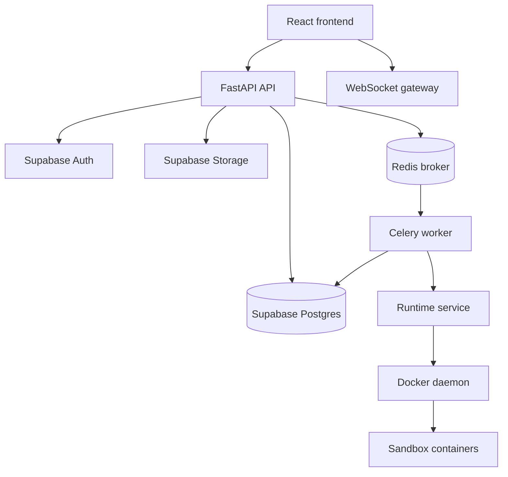

# ScopeForge Senior Engineering Interview Guide

## 1. Purpose

This guide converts the ScopeForge project decisions into interview-style questions and answers.

The goal is to help you prepare for senior software engineering, backend, and system design interviews using this project as your real example.

Use this document to practice:

- Explaining what the system does.
- Defending technical decisions.
- Discussing tradeoffs.
- Showing production-level thinking.
- Explaining boundaries between API, service, repository, agent, runtime, and infrastructure layers.
- Naming risks and how you would handle them.

## 2. Project Elevator Pitch

### Q1. What is this project?

**Strong answer**

ScopeForge is an AI-assisted security testing orchestration platform for authorized security teams. It lets operators define a project, scope, objective, policy, and session. The system can then plan tasks, run approved tools inside isolated runtimes, stream progress to the UI, preserve evidence, and generate reports.

The important part is that the product is not just a chatbot. It is a control plane around agents, tools, policy, runtime isolation, audit trails, evidence, and human approvals.

**Why this answer works**

It shows that you understand the product as a production system, not just as an LLM wrapper.

**Tradeoff**

The product is more complex than a simple chat UI because it needs scope enforcement, runtime isolation, durable state, and auditability.

### Q2. Why rewrite instead of fork the reference project?

**Strong answer**

We chose to rewrite because the purpose is to learn and build production-level understanding from first principles. A fork would be faster for feature additions, but it would also inherit architecture decisions, naming, coupling, and technical debt from the original project.

By rewriting, we can design clear boundaries, choose our own stack, build a database model that matches our product, and understand every major subsystem: auth, API, jobs, agents, runtime, evidence, and policy.

**Tradeoff**

Rewrite gives better learning and architectural control, but it costs more time and increases risk because we must rebuild many foundations ourselves.

**Interview follow-up**

If asked when you would fork instead, say: if the goal were speed to market, compatibility, or contributing back to the existing ecosystem, a fork would be better.

### Q3. Why did we write docs before code?

**Strong answer**

Because this system has several high-impact boundaries: auth, runtime execution, policy enforcement, background jobs, evidence storage, and agent orchestration. If we start coding without defining those contracts, we risk mixing business logic into routes, letting agents bypass policy, or putting Docker privileges in the wrong place.

Docs first helped us lock decisions before implementation:

- Backend-mediated Supabase Auth.
- SQLAlchemy for product data.
- Redis + Celery for execution, with Postgres job tables as the source of truth.
- Runtime service separate from worker.
- WebSocket from the start.
- Layered backend structure.

**Tradeoff**

Docs-first can slow initial coding, but it prevents expensive redesign when system boundaries matter.

## 3. System Design Overview

### Q4. How would you explain the high-level architecture?

**Strong answer**

The architecture has a frontend, an API control plane, a worker execution plane, a runtime service, and managed platform services.



The API handles auth, permissions, REST, WebSocket, and coordination. Workers handle long-running jobs. The runtime service owns Docker access and sandbox execution. Postgres stores durable product state.

**Tradeoff**

This is more complex than a monolith, but each part has a clear reason to exist.

### Q5. What are the main architectural boundaries?

**Strong answer**

The most important boundaries are:

- Frontend never talks directly to Supabase.
- API routes do not contain business logic.
- Services orchestrate use cases.
- Repositories own database access.
- Agents propose actions, but policy decides what may execute.
- Workers execute background jobs, but Postgres owns job state.
- Runtime service owns Docker access, not the worker.

**Why this matters**

These boundaries reduce coupling, improve testability, and make it easier to reason about production failures.

### Q6. What is the difference between API layer, service layer, repository layer, and agent layer?

**Strong answer**

The API layer is HTTP-specific. It handles routing, request validation, response models, auth dependencies, and status codes.

The service layer owns use-case orchestration. It decides what repositories, policies, integrations, jobs, or agents are needed to complete a workflow.

The repository layer owns persistence. It is where SQLAlchemy queries and database writes live.

The agent layer owns AI roles like planner and executor. Agents produce structured outputs and tool proposals, but they do not bypass services, repositories, or policy.

**Example**

```text
POST /api/v1/sessions
  -> api route validates request
  -> service creates session workflow
  -> repository writes session rows
  -> service enqueues job
  -> worker later runs planner agent
```

**Tradeoff**

Layering adds files and indirection, but it protects the codebase from becoming route-handler spaghetti.

## 4. Tech Stack Decisions

### Q7. Why Python for the backend?

**Strong answer**

Python is a strong fit because this project combines API development, background workers, AI providers, security tooling, scripting, and data processing. The ecosystem around FastAPI, SQLAlchemy, Celery, Pydantic, LLM clients, and security tools is mature.

**Tradeoff**

Python is not the fastest runtime for CPU-heavy workloads. For this system, most work is I/O-bound or delegated to external tools, databases, LLM providers, and containers. If CPU-heavy workloads appear, we can isolate them into separate services.

### Q8. Why FastAPI?

**Strong answer**

FastAPI gives us typed request/response models through Pydantic, OpenAPI generation, good dependency injection, strong async support for WebSockets, and a clean developer experience.

It also works well with sync SQLAlchemy route handlers because FastAPI can run sync handlers through threadpool boundaries.

**Tradeoff**

FastAPI is less batteries-included than Django. We must define our own service structure, auth wiring, migrations, and admin workflows.

### Q9. Why React + TypeScript + Vite for the frontend?

**Strong answer**

React + TypeScript is a standard choice for complex dashboards and operator workflows. TypeScript gives compile-time safety for API contracts and UI state. Vite gives fast local development and a simple build setup.

**Tradeoff**

React gives flexibility, but it also means we must be disciplined about state management, API clients, and component boundaries.

### Q10. Why Supabase Postgres as the database?

**Strong answer**

The product needs relational integrity, transactional state, JSON metadata, audit trails, vector memory, and storage/auth integration. Supabase gives us managed Postgres, pgvector, Auth, and Storage without building platform services from scratch.

We still treat Supabase Postgres as normal Postgres from the backend. Product reads and writes go through SQLAlchemy, not Supabase table helpers.

**Tradeoff**

Supabase accelerates development, but it creates some platform dependency. We reduce lock-in by keeping application data access through SQLAlchemy and storage/auth behind adapters.

### Q11. Why SQLAlchemy instead of using Supabase table helpers?

**Strong answer**

SQLAlchemy keeps database access consistent across API routes, workers, tests, and migrations. It also makes transactions, joins, repository patterns, and schema evolution easier to control.

Supabase table helpers are useful for simple apps, but this product needs service-layer business rules, multi-table transactions, background workers, and migration discipline.

**Tradeoff**

SQLAlchemy takes more setup and requires us to manage models and migrations, but it is more appropriate for a production backend with complex workflows.

### Q12. Why sync SQLAlchemy instead of async SQLAlchemy?

**Strong answer**

We chose sync SQLAlchemy because the early system will have many worker-driven workflows, and Celery workers are naturally synchronous. Sync SQLAlchemy is easier to debug and reason about during the first build.

FastAPI can safely run sync route handlers through threadpool boundaries. We can introduce async SQLAlchemy later only for specific high-concurrency paths if profiling shows a real need.

**Tradeoff**

Async SQLAlchemy can scale well for high-concurrency I/O, but it adds complexity across sessions, testing, transaction handling, and library compatibility.

### Q13. Why Alembic for migrations?

**Strong answer**

Alembic is the standard migration tool for SQLAlchemy. It gives us explicit migration scripts, versioned schema history, rollback support where practical, and a clear production deployment path.

**Tradeoff**

Alembic requires discipline. We should avoid editing applied migrations, keep migrations small, and review generated scripts instead of blindly trusting autogenerate.

## 5. Auth and Authorization

### Q14. Why should frontend auth requests go through the backend instead of calling Supabase Auth directly?

**Strong answer**

Because the backend is the product control plane. It needs to map Supabase users to workspace users, roles, permissions, audit events, backend sessions, and security policies.

If the frontend talks directly to Supabase Auth, auth logic spreads into the browser and it becomes harder to enforce consistent authorization, session revocation, and audit trails.

**Tradeoff**

Backend-mediated auth is more work than using Supabase directly from the frontend, but it gives stronger control and is more appropriate for enterprise/security-sensitive software.

### Q15. Why use HttpOnly backend cookies?

**Strong answer**

HttpOnly cookies reduce the risk of JavaScript reading session tokens during XSS. The browser sends the cookie automatically, while the backend owns session lookup and refresh behavior.

We pair this with CSRF protection for unsafe methods.

**Tradeoff**

Cookies require CSRF handling and careful SameSite/Secure settings. Token-in-local-storage is simpler but riskier.

### Q16. What is the difference between authentication and authorization in this project?

**Strong answer**

Authentication proves who the user is. Supabase Auth handles identity verification.

Authorization decides what the user can do. Our backend handles authorization using workspace membership, roles, permissions, policies, and resource ownership.

**Example**

A user may be authenticated, but still denied `sessions.approve` if their workspace role does not include that permission.

### Q17. Why add `auth_sessions` when Supabase already has sessions?

**Strong answer**

Supabase sessions verify identity, but our product needs backend-owned browser sessions for workspace context, CSRF binding, server-side revocation, audit, and product-specific session rules.

`auth_sessions` lets us revoke or expire an application session even if the Supabase session still exists.

**Tradeoff**

This adds another session layer, but it gives the backend full product-level control.

## 6. Database and Data Modeling

### Q18. How is the database organized?

**Strong answer**

The database is grouped by product responsibility:

- Identity: workspaces, users, roles, auth sessions, API tokens.
- Configuration: providers, policies, tool definitions.
- Project model: projects, targets, scopes, resources.
- Session execution: sessions, tasks, steps, agent messages, tool calls, runtime instances.
- Workflow control: approvals, session events, jobs.
- Review and reporting: evidence, findings, reports.
- Memory: documents, chunks, embeddings.
- Audit: security-sensitive actions.

**Why this matters**

It shows the database is not just tables. It is a model of the product's operational behavior.

### Q19. Why use relational tables instead of storing everything as JSON documents?

**Strong answer**

The product needs strong relationships and traceability. A tool call must connect to a session, task, step, agent message, policy decision, evidence item, and audit trail. Relational modeling gives referential integrity and reliable queries.

We still use JSONB for areas that evolve quickly, such as policy rules and tool arguments.

**Tradeoff**

Pure JSON is faster to change early, but it becomes harder to query, enforce, and audit. Pure normalization can become rigid. We use both: relational core plus JSONB for flexible metadata.

### Q20. Why persist `session_events` if WebSocket already streams events?

**Strong answer**

WebSocket is a transport, not durable storage. If the browser disconnects, the user should reconnect and replay missed events. Persisted `session_events` also support audit, debugging, timeline views, and recovery.

**Tradeoff**

Storing events adds write volume. We can manage that with retention policies and by keeping large outputs in artifacts instead of events.

### Q21. Why have a `jobs` table if Celery already tracks tasks?

**Strong answer**

Celery is an execution engine, not our product state model. Product-visible status, progress, retries, errors, and outputs need to live in Postgres so the system is recoverable and auditable.

Celery task ids are correlation metadata only.

**Tradeoff**

We must maintain our own job state updates, but this gives better durability, user visibility, and control over retries and recovery.

## 7. Background Jobs

### Q22. Why Redis + Celery?

**Strong answer**

Redis + Celery is a mature Python background job stack. It fits long-running work like planning, session execution, report generation, embeddings, cleanup, and runtime reconciliation.

Redis is the broker. Celery workers execute tasks. Postgres owns durable product state.

**Tradeoff**

Celery is powerful but operationally non-trivial. We need visibility, retries, idempotency, and worker recovery logic.

### Q23. What does idempotency mean for this project?

**Strong answer**

Idempotency means retrying the same operation should not accidentally create duplicate sessions, duplicate approvals, duplicate tool calls, or duplicate reports.

For APIs, we can use `Idempotency-Key`. For workers, we use job ids, status transitions, and uniqueness constraints where needed.

**Interview follow-up**

Mention that retries are unavoidable in distributed systems. The system must assume jobs can run twice or fail halfway.

### Q24. How do workers recover after failure?

**Strong answer**

Workers recover by reading durable state from Postgres: jobs, sessions, tool calls, runtime instances, approval requests, and events. They ask the runtime service for actual runtime state, then resume safe work or mark sessions for review.

Redis can be flushed without losing historical product state.

## 8. Runtime and Sandbox Design

### Q25. Why use a separate runtime service instead of mounting Docker socket into the worker?

**Strong answer**

Docker socket access is very powerful. If the worker has direct Docker socket access and is compromised, the attacker may gain broad control over the host.

We isolate Docker access inside a runtime service. The worker calls a small internal API like start runtime, execute command, collect artifact, and stop runtime.

**Tradeoff**

The runtime service adds another component, but it gives a cleaner security boundary and makes it easier to replace Docker later with Kubernetes, Firecracker, or remote runners.

### Q26. What does the runtime service own?

**Strong answer**

It owns sandbox lifecycle and execution:

- Start and stop containers.
- Mount per-session workspaces.
- Execute approved commands.
- Stream stdout/stderr.
- Enforce timeouts and resource limits.
- Collect artifacts.
- Cleanup stale runtime state.
- Own Docker socket access.

It does not decide high-level business policy. Policy is evaluated before execution.

### Q27. Why Docker first?

**Strong answer**

Docker is the fastest practical runtime backend for local development and early sandbox execution. It is widely understood, easy to run with Compose, and good enough for first isolation boundaries.

**Tradeoff**

Docker is not a perfect security sandbox. For stronger isolation, we may later add Firecracker microVMs, Kubernetes jobs, remote runners, or stricter container hardening.

## 9. Realtime Design

### Q28. Why WebSocket from the start instead of SSE?

**Strong answer**

WebSocket supports both server-to-client events and future client-to-server interactions on the same channel. This product may need terminal input, approvals, cancellations, collaborative state, and live session controls.

SSE would be simpler for one-way event streaming, but WebSocket gives us a better long-term transport for interactive operator workflows.

**Tradeoff**

WebSocket requires more connection lifecycle handling, heartbeats, auth, reconnect logic, and scaling strategy. We reduce risk by persisting events in Postgres so WebSocket is not the source of truth.

### Q29. How would WebSocket scale later?

**Strong answer**

For one API instance, in-memory connection management is enough. For multiple API instances, we need a fanout layer such as Redis pub/sub, Postgres notifications, or a dedicated event bus.

Durable event history remains in Postgres. The fanout layer only helps distribute live events.

## 10. Agents, Tools, and Policy

### Q30. How do agents interact with tools?

**Strong answer**

Agents propose structured tool calls. The system validates the tool schema, checks policy, may require approval, and only then executes through the runtime or integration layer.

The agent does not get to bypass policy or execute arbitrary commands directly.

### Q31. Why keep policy outside prompts?

**Strong answer**

Prompts are advisory. Policy must be deterministic, auditable, and enforceable outside the model.

The model can propose actions, but the policy engine decides whether those actions are allowed, denied, or require approval.

**Tradeoff**

External policy adds engineering complexity, but it is essential for a security-sensitive product.

### Q32. Why define agent roles like planner, executor, reporter, and supervisor?

**Strong answer**

Separate roles make the system easier to reason about. The planner creates tasks, the executor performs steps, the reporter creates findings and reports, and the supervisor monitors quality, loops, risk, and policy issues.

The first implementation can run these roles in one worker process. The separation is logical before it is physical.

**Tradeoff**

Too many agent roles too early can overcomplicate the system. We keep roles clear but implement incrementally.

### Q33. How do we handle hidden chain-of-thought or model reasoning?

**Strong answer**

We do not store private hidden chain-of-thought. We store visible assistant output, tool calls, structured decisions, summaries, token counts, and audit metadata.

This keeps logs useful while respecting provider boundaries and avoiding noisy or sensitive internal reasoning.

## 11. Backend Layering and Code Organization

### Q34. Why did we create API, service, repository, domain, agents, and integrations folders?

**Strong answer**

Because senior-level backend systems need separation of concerns:

- `api` handles HTTP.
- `schemas` defines request and response contracts.
- `services` orchestrates use cases.
- `repositories` owns SQLAlchemy queries.
- `models` maps database tables.
- `domain` owns business concepts and exceptions.
- `agents` owns AI roles.
- `integrations` wraps external systems.

This makes the system testable, scalable, and easier to change.

### Q35. What should never happen inside a route handler?

**Strong answer**

A route handler should not contain SQLAlchemy queries, business workflows, Supabase calls, Celery calls, runtime calls, or agent execution.

Routes should validate input, call a service, and return a response.

**Why this matters**

If route handlers become fat, the same business logic becomes hard to reuse from workers, tests, CLI scripts, or internal services.

### Q36. Where should transactions live?

**Strong answer**

Transaction ownership should usually live in the service layer because services understand use-case boundaries. Repositories perform database operations, but the service decides which operations belong in the same transaction.

**Tradeoff**

Small CRUD operations can use repository-managed transactions, but complex workflows need service-level transaction control.

### Q37. Where should external clients live?

**Strong answer**

External clients belong in `integrations`. Supabase Auth, Supabase Storage, runtime service, queue, provider APIs, and future notification systems should all be wrapped behind adapters.

This keeps services testable and prevents vendor-specific code from spreading across the codebase.

## 12. Production Readiness

### Q38. What production concerns are already considered?

**Strong answer**

We have already considered:

- Backend-mediated auth.
- HttpOnly sessions and CSRF.
- Workspace RBAC.
- SQL migrations through Alembic.
- Durable job tables.
- Durable realtime events.
- Runtime service boundary.
- Docker socket isolation.
- Policy checks outside prompts.
- Auditability.
- Clear backend layers.
- Docker Compose first for local deployment.

### Q39. What is missing before production?

**Strong answer**

Major missing pieces include:

- Real Supabase Auth integration.
- SQLAlchemy models and first migration.
- Session persistence and state transitions.
- WebSocket auth and replay.
- Runtime Docker adapter.
- Policy engine implementation.
- Worker recovery logic.
- Observability: logs, metrics, traces.
- CI/CD.
- Test coverage.
- Secret management.
- Rate limiting.
- Deployment hardening.

This is why the current state is a scaffold, not a production release.

### Q40. How would you test this system?

**Strong answer**

I would test it at multiple levels:

- Unit tests for services, policy decisions, state transitions, and repositories.
- Integration tests for API routes, database migrations, auth session flow, and worker jobs.
- Runtime tests for path restrictions, command timeout, output truncation, and cleanup.
- WebSocket tests for auth, reconnect, and replay.
- End-to-end tests for session creation, approval, execution, evidence, and report flow.

**Tradeoff**

End-to-end tests provide confidence but are slower and more brittle. Unit and integration tests should carry most of the coverage.

### Q41. What observability would you add?

**Strong answer**

I would add structured logs, request ids, trace ids, job ids, session ids, metrics, and audit events.

Important metrics:

- API latency and error rates.
- WebSocket connection counts.
- Worker queue depth.
- Job duration and failure rate.
- Runtime container count.
- Tool execution duration.
- Policy denials and approval counts.
- LLM token usage and cost.

### Q42. How would you handle secrets?

**Strong answer**

Secrets should live in environment variables or a secret manager, not in code. Supabase service role keys must never reach the frontend. Provider keys should be encrypted at rest and only decrypted by backend services that need them.

Logs must mask tokens, cookies, refresh tokens, API keys, and sensitive runtime output.

## 13. Scalability Questions

### Q43. How does this design scale horizontally?

**Strong answer**

The API can scale horizontally if session state is stored in Postgres and realtime fanout is handled through a shared event layer. Workers can scale horizontally by pulling from Redis/Celery. Runtime services can scale separately as execution demand grows.

Postgres remains the central source of truth, so we need good indexes, connection pooling, and careful transaction boundaries.

### Q44. What are likely bottlenecks?

**Strong answer**

Likely bottlenecks include:

- Postgres write volume from events and tool outputs.
- WebSocket fanout under many sessions.
- Worker queue backlog.
- Runtime container startup time.
- LLM provider latency and rate limits.
- Large artifact storage and downloads.

Each bottleneck has a different scaling strategy.

### Q45. How would you reduce database pressure from realtime logs?

**Strong answer**

Store durable lifecycle events in Postgres, but avoid storing huge raw output chunks directly in the event table. Large outputs should be truncated, chunked with retention, or stored as artifacts in object storage with metadata in Postgres.

For live fanout, use Redis pub/sub or another event bus so clients do not poll heavy database queries.

## 14. Senior-Level Tradeoff Questions

### Q46. What is the biggest architectural risk right now?

**Strong answer**

The biggest risk is complexity. This system has API, worker, runtime, agents, policy, database, storage, realtime, and auth. If boundaries are not enforced, the codebase can become hard to reason about.

We reduce that risk with explicit layers, docs, service boundaries, and small incremental phases.

### Q47. What decision would you revisit later?

**Strong answer**

I would revisit:

- Sync SQLAlchemy if API concurrency becomes a bottleneck.
- Docker runtime if stronger isolation is required.
- Redis/Celery if workflow orchestration needs become more complex.
- Hosted Supabase if self-hosting or enterprise deployment becomes required.
- WebSocket fanout strategy when scaling beyond one API instance.

Good architecture is not about never changing decisions. It is about making decisions reversible where possible.

### Q48. What does "source of truth" mean in this system?

**Strong answer**

The source of truth is the durable system of record. In this project, Postgres is the source of truth for users, sessions, jobs, events, tool calls, evidence, reports, approvals, and policy decisions.

Redis, Celery, WebSocket connections, and runtime containers are execution or transport mechanisms. They are not the durable product state.

### Q49. How do you prevent agents from doing unsafe things?

**Strong answer**

We prevent unsafe actions by combining multiple layers:

- Scope is structured.
- Tool calls are schema-validated.
- Policy returns allow, deny, or require approval.
- High-risk actions pause for human approval.
- Runtime service enforces file, network, timeout, and resource constraints.
- Every action is logged and auditable.

The model proposes. The system enforces.

### Q50. How would you explain this project as interview evidence?

**Strong answer**

I would say:

"I am building ScopeForge, a production-style AI security testing orchestration platform from first principles. I started with product and architecture docs, then locked key tradeoffs around Python/FastAPI, Supabase Postgres, backend-mediated Supabase Auth, sync SQLAlchemy, Alembic, Redis/Celery, durable job tables, WebSocket realtime, and a separate runtime service for Docker execution. I then scaffolded the backend with clear API, service, repository, domain, agent, and integration layers so the implementation stays testable and scalable."

This answer shows product thinking, system design, backend architecture, security, and production awareness.

## 15. Practice Prompts

Use these prompts to practice out loud:

1. Explain the whole architecture in two minutes.
2. Defend backend-mediated Supabase Auth.
3. Explain why SQLAlchemy is used instead of Supabase table helpers.
4. Explain sync SQLAlchemy versus async SQLAlchemy.
5. Explain why Celery task results are not the source of truth.
6. Explain why the worker should not mount the Docker socket.
7. Explain WebSocket versus SSE for this project.
8. Explain how you would recover after a worker crash.
9. Explain how you enforce policy outside prompts.
10. Explain what is missing before production.

## 16. Short Interview Cheat Sheet

| Topic | Decision | Interview Phrase |
| --- | --- | --- |
| Backend | Python + FastAPI | Strong AI ecosystem and typed API contracts |
| Frontend | React + TypeScript + Vite | Operator dashboard with type safety |
| Database | Supabase Postgres | Managed Postgres, Auth, Storage, pgvector |
| ORM | Sync SQLAlchemy | Simpler first build, worker-friendly |
| Migrations | Alembic | Explicit schema history |
| Auth | Backend-mediated Supabase Auth | Backend owns sessions, RBAC, audit |
| Queue | Redis + Celery | Mature Python background execution |
| Job state | Own Postgres job tables | Durable product source of truth |
| Runtime | Separate runtime service | Docker privilege boundary |
| Realtime | FastAPI WebSocket | Interactive operator workflows |
| Layers | API/service/repository/agent | Maintainability and testability |
| Policy | Outside prompts | Deterministic, auditable enforcement |
