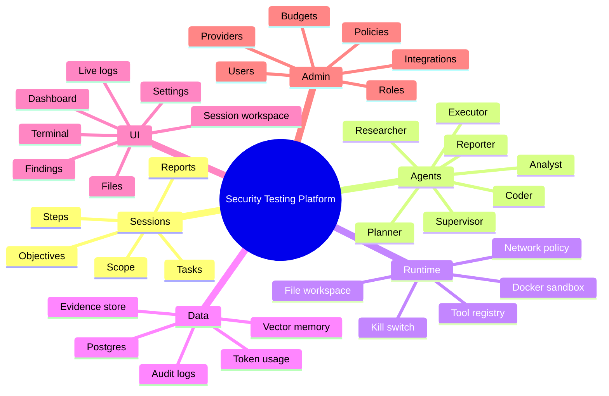
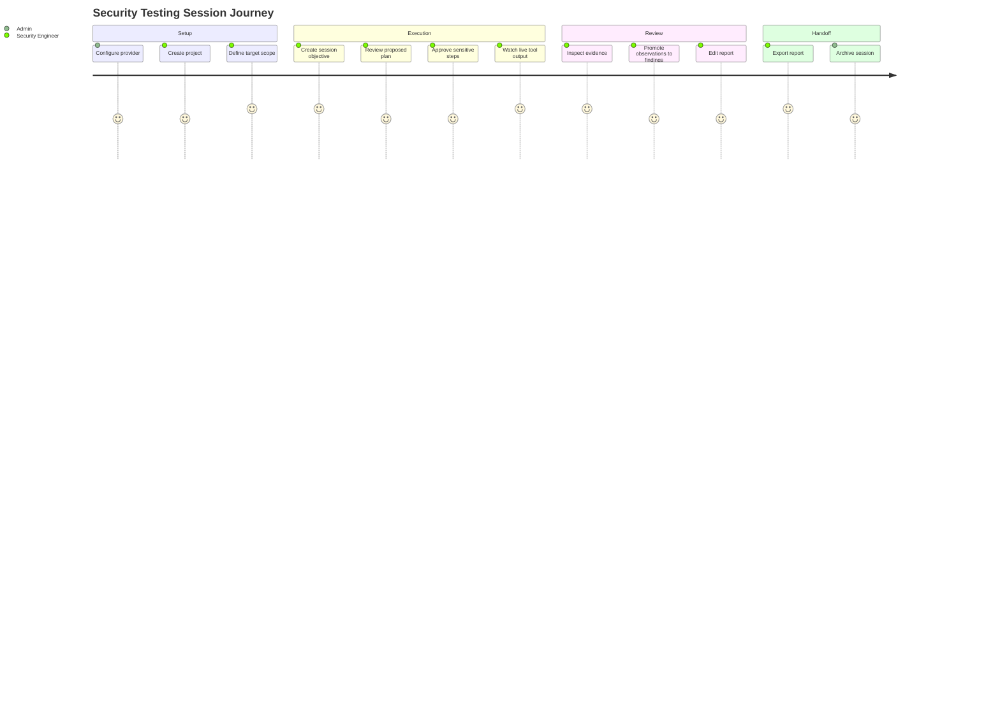
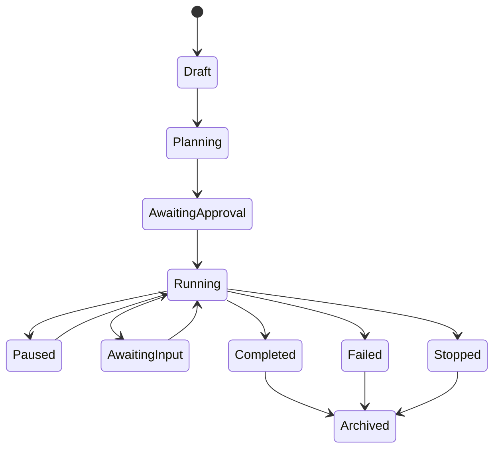
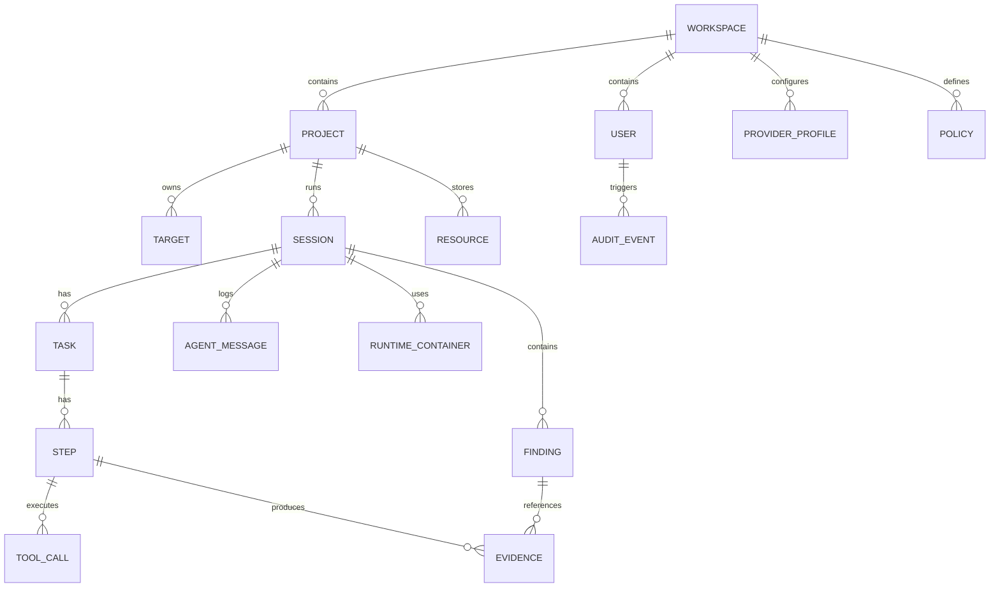

# ScopeForge Product Spec

## 1. Purpose

ScopeForge is a clean-room AI-assisted security testing platform. The product should help authorized security practitioners turn a high-level objective into a controlled workflow: plan the test, run tools in isolated environments, observe progress, collect evidence, and generate a report.

The product is not a generic chatbot. The core value is the orchestration loop:

```text
authorized objective -> scoped plan -> sandboxed tool execution -> evidence -> review -> report
```

## 2. Product Vision

Build a security testing cockpit where a human operator can supervise AI agents that perform structured, auditable work. The system should be useful for application security teams, internal red teams, security consultants, lab researchers, and defensive validation teams.

The product should feel like a professional operations tool:

- Clear session state.
- Reproducible evidence.
- Strong permission boundaries.
- Transparent agent reasoning and tool activity.
- Easy handoff from automated findings to human review.

## 3. Target Users

### Security Engineer

Primary operator who creates testing sessions, approves actions, reviews findings, and exports reports.

Needs:

- Fast setup for common testing workflows.
- Live view of agent activity.
- Evidence tied to findings.
- Ability to pause, steer, or stop execution.

### Red Team Operator

Advanced user who wants repeatable campaigns, custom tools, attack-chain templates, and explicit control over risk.

Needs:

- Campaign planning.
- Approval gates.
- Reusable playbooks.
- Tool/plugin extensibility.
- Strong logging for after-action review.

### AppSec Reviewer

User focused on web/API testing, code-adjacent findings, and developer-ready reports.

Needs:

- Web/API test templates.
- Clear reproduction steps.
- Severity and remediation guidance.
- Export formats that fit engineering workflows.

### Administrator

Configures providers, users, roles, runtime policies, system integrations, and audit controls.

Needs:

- RBAC.
- Provider and budget controls.
- Sandbox limits.
- Audit trail.
- Deployment and monitoring visibility.

## 4. Core Product Concepts

### Workspace

A tenant or installation boundary that owns users, settings, providers, policies, and stored data.

### Project

A logical grouping for targets, assets, credentials, rules of engagement, reports, and historical sessions.

### Session

A single security testing run. Similar to a "flow" in the reference project, but renamed to be clearer.

### Objective

The user-provided goal for a session, such as:

- "Assess this staging web app for common authentication flaws."
- "Run external recon against these approved domains."
- "Validate whether this host exposes risky services."

### Scope

The explicit permission boundary for a session:

- Allowed domains, IPs, repos, APIs, and environments.
- Disallowed actions.
- Rate limits.
- Credential usage rules.
- Required approval points.

### Plan

Agent-generated or template-generated task structure for completing the objective.

### Task

A major phase of work, such as recon, enumeration, vulnerability validation, exploit research, reporting, or cleanup.

### Step

A concrete executable unit inside a task. A step may call a tool, ask the user for input, write a file, run a command, search memory, or produce evidence.

### Tool Call

A structured request to use a capability, such as terminal execution, file read/write, browser fetch, screenshot, network scanner, search, or vector memory.

### Evidence

Any artifact that supports a finding:

- Terminal output.
- HTTP request/response.
- Screenshot.
- File.
- Search result.
- Structured observation.
- Agent note.

### Finding

A reviewed security issue or observation with severity, affected asset, proof, reproduction steps, impact, and remediation.

### Report

An exported view of the session, tasks, evidence, findings, and recommendations.

## 5. Capability Map



## 6. User Journey



## 7. Functional Requirements

### 7.1 Authentication and Authorization

The product should support:

- Local login.
- Optional OAuth/OIDC.
- API tokens for automation.
- Role-based permissions.
- Session timeout.
- Audit records for sensitive actions.

Important roles:

- Admin: system-wide configuration.
- Operator: create and run sessions.
- Reviewer: inspect sessions and reports.
- Viewer: read-only access.

### 7.2 Provider Management

The system should support multiple model providers through adapter interfaces:

- OpenAI-compatible APIs.
- Anthropic.
- Google Gemini.
- AWS Bedrock.
- Ollama or local inference.
- Custom enterprise gateways.

Provider configuration should include:

- API endpoint.
- API key or credential mode.
- Default models per agent role.
- Token and cost limits.
- Timeout settings.
- Streaming support.
- Tool-calling support.
- Reasoning support, if available.

### 7.3 Project and Scope Management

Every session should be tied to explicit scope.

Scope fields:

- Allowed domains.
- Allowed IP ranges.
- Allowed URLs.
- Allowed repos.
- Allowed credentials.
- Disallowed targets.
- Max request rate.
- Max scan depth.
- Tool allowlist/denylist.
- Required approval levels.

The scope should be enforced before tool execution, not only shown in prompts.

### 7.4 Session Management

Users should be able to:

- Create a session from an objective.
- Attach resources and credentials.
- Choose model provider/profile.
- Choose template or manual mode.
- Start, pause, resume, stop, and archive a session.
- Add new objectives to an existing session.
- Compare session runs over time.

Session statuses:



### 7.5 Agent Orchestration

Agent roles should be explicit and replaceable:

- Planner: decomposes objectives into tasks and steps.
- Executor: coordinates step execution.
- Researcher: searches web, docs, exploit databases, and memory.
- Coder: writes scripts, parsers, checks, and proof-of-concept helpers inside policy limits.
- Analyst: interprets evidence and proposes findings.
- Reporter: creates final report content.
- Supervisor: monitors loops, tool abuse, policy violations, and low-quality behavior.

The system should support both:

- Autonomous mode: agents proceed until blocked, completed, or stopped.
- Assisted mode: user chats with an assistant that can inspect and control a session.

### 7.6 Tool Runtime

Tools should be registered through a typed tool interface.

Core tools:

- Terminal command execution.
- File read/write/list.
- HTTP request tool.
- Browser/page fetch tool.
- Screenshot tool.
- Search tool.
- Vector memory search/store.
- Report/finding creation.
- User question tool.
- Session control tool.

Tool calls should include:

- Tool name.
- Arguments.
- Initiating agent.
- Status.
- Start/end timestamps.
- Result.
- Error.
- Evidence references.
- Policy decision.

### 7.7 Sandboxed Execution

Commands and security tools must run in isolated runtimes.

Required controls:

- Per-session container.
- Per-session file workspace.
- Network egress policy.
- CPU and memory limits.
- Timeout per command.
- Kill switch.
- No direct host shell execution.
- Optional read-only base image.
- Configurable tool images.

### 7.8 Files and Resources

Users should be able to upload:

- Scope documents.
- API specs.
- Credentials files.
- Wordlists.
- Source snippets.
- Target documentation.

The system should distinguish:

- User resources: reusable across sessions.
- Session files: generated or copied into a session.
- Evidence files: artifacts tied to findings or steps.

### 7.9 Evidence and Findings

Evidence should be first-class.

A finding should include:

- Title.
- Severity.
- Confidence.
- Affected assets.
- Description.
- Impact.
- Evidence links.
- Reproduction steps.
- Remediation.
- References.
- Review status.

Finding statuses:

- Candidate.
- Needs review.
- Confirmed.
- False positive.
- Accepted risk.
- Fixed.

### 7.10 Reporting

The product should generate reports in multiple formats:

- Web view.
- Markdown.
- PDF.
- JSON.
- SARIF, later if code/security scanners are integrated.

Report sections:

- Executive summary.
- Scope.
- Methodology.
- Findings.
- Evidence.
- Timeline.
- Tool activity summary.
- Limitations.
- Recommendations.

### 7.11 Knowledge and Memory

The system should keep controlled memory:

- Session memory: short-term context for one session.
- Project memory: reusable facts about a project.
- Global knowledge: reusable tool guides and generic security techniques.

Memory storage should support:

- Embeddings.
- Metadata filters.
- Expiration.
- Manual review.
- Deletion.
- Source traceability.

### 7.12 Observability

The product should track:

- Session state transitions.
- Agent calls.
- Tool calls.
- Errors.
- Token usage.
- Cost.
- Runtime metrics.
- Queue depth.
- Container health.

Optional integrations:

- OpenTelemetry.
- Prometheus/Grafana.
- Langfuse or equivalent LLM tracing.

## 8. Non-Functional Requirements

### Security

- Enforce scope before execution.
- Encrypt secrets at rest.
- Avoid logging raw secrets.
- Use least privilege for worker containers.
- Separate control plane from execution plane.
- Maintain immutable audit records for critical actions.

### Reliability

- Workers should resume or mark sessions safely after restart.
- Tool calls should have idempotency keys when possible.
- Long-running operations should heartbeat.
- Queue jobs should be retryable with bounded retries.

### Performance

- UI should stream logs without freezing.
- Large logs should paginate or virtualize.
- Token-heavy context should be summarized.
- Vector search should be filtered by workspace/project/session.

### Extensibility

- Add providers without changing orchestration logic.
- Add tools without changing agent loop internals.
- Add report exporters without rewriting reports.
- Add runtime backends beyond Docker later.

### Compliance and Audit

- Preserve who did what and when.
- Keep evidence lineage.
- Allow data retention policies.
- Support export and deletion workflows.

## 9. High-Level Data Model



## 10. Product Boundaries

### In Scope

- Authorized security testing workflows.
- Agent-assisted planning and execution.
- Sandboxed command/tool execution.
- Evidence collection.
- Human approval and review.
- Reporting.
- Provider and tool extensibility.

### Out of Scope

- Unauthorized access.
- Malware creation or deployment.
- Stealth persistence.
- Credential theft.
- Automated destructive actions without explicit approval and policy support.
- Public attack automation against targets without proof of authorization.

## 11. Open Product Questions

- Should we use "project/session/task/step" naming, or keep "flow/task/subtask"?
- Should campaign/BAS features be core from day one or a later module?
- Should the first version require Docker, or support a remote runtime service immediately?
- Should reports be generated only from reviewed findings, or also include raw agent output?
- Should external tool plugins run inside the same sandbox or in separate isolated services?
- Final product name: ScopeForge.
