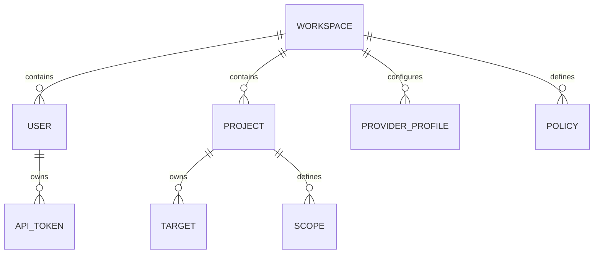
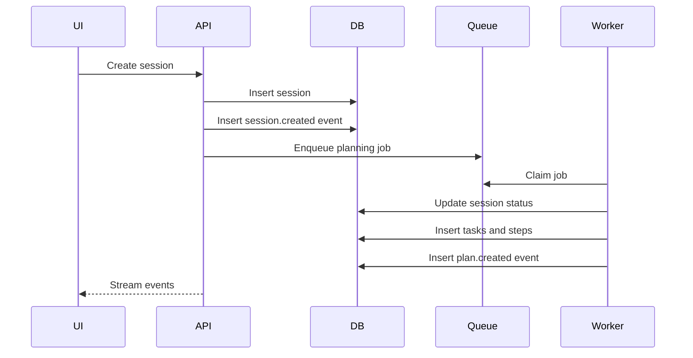
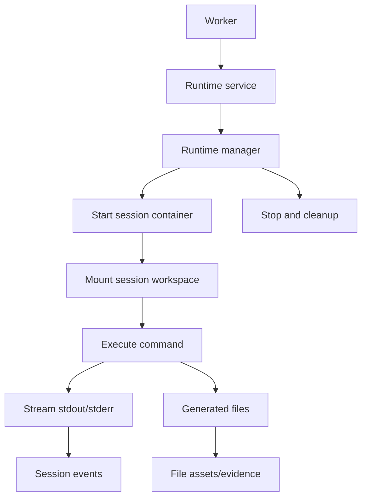
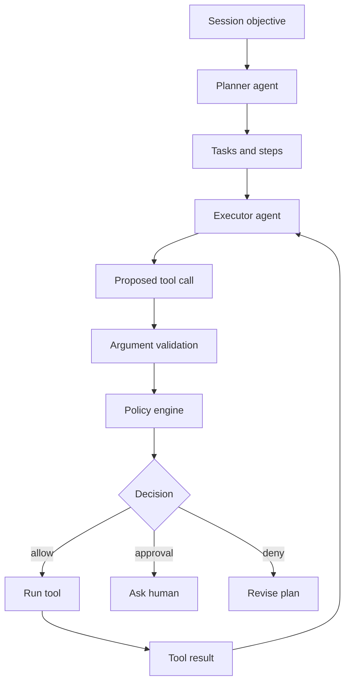
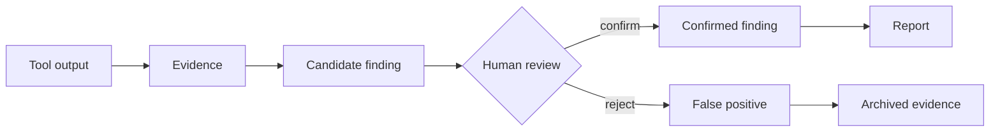
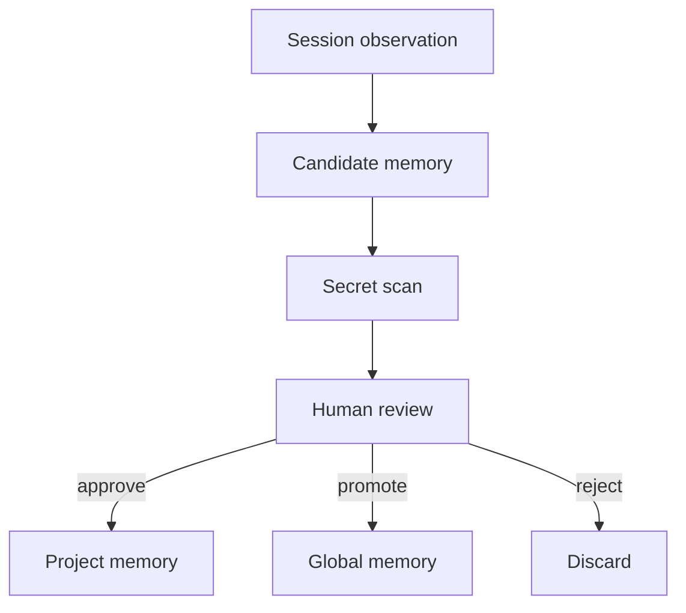
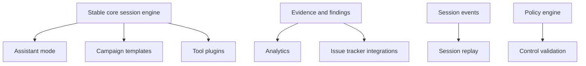
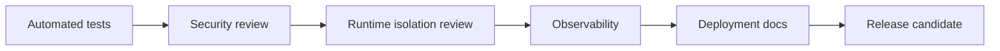
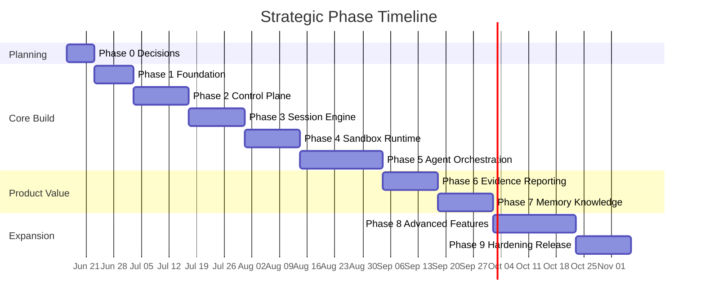

# ScopeForge Project Phases

## 1. Purpose

This document defines the planned build phases for ScopeForge. It is not the MVP plan. The purpose is to describe the order in which major parts of the product should be designed and built so the project stays coherent as it grows.

The MVP plan will later select a smaller subset from these phases and turn it into a concrete first release.

## 2. Phase Overview

```mermaid
flowchart LR
    P0[Phase 0<br/>Product and Stack Decisions]
    P1[Phase 1<br/>Foundation]
    P2[Phase 2<br/>Control Plane]
    P3[Phase 3<br/>Session Engine]
    P4[Phase 4<br/>Sandbox Runtime]
    P5[Phase 5<br/>Agent Orchestration]
    P6[Phase 6<br/>Evidence and Reporting]
    P7[Phase 7<br/>Memory and Knowledge]
    P8[Phase 8<br/>Advanced Features]
    P9[Phase 9<br/>Hardening and Release]

    P0 --> P1 --> P2 --> P3 --> P4 --> P5 --> P6 --> P7 --> P8 --> P9
```

## 3. Phase Principles

- Build the control plane before deep automation.
- Build audit and state tracking before complex agents.
- Build policy checks outside prompts.
- Build the sandbox before allowing powerful tools.
- Build evidence as a first-class model, not a report afterthought.
- Keep each phase independently testable.
- Prefer narrow vertical slices over broad unfinished layers.

## 4. Phase 0: Product and Stack Decisions

### Goal

Finalize the non-code decisions that affect the entire rewrite.

### Key Decisions

- Product name.
- API style details.
- Hosted Supabase first for local development.
- WebSocket first for realtime.
- Separate runtime service for Docker access.
- Naming model: project/session/task/step versus flow/task/subtask.

### Deliverables

- Finalized technology decision record. See [Tech Stack Decision](TECH_STACK_DECISION.md).
- Updated architecture doc reflecting chosen stack.
- Initial repository layout.
- Coding conventions.
- Local development expectations.

### Exit Criteria

- We know the backend is Python/FastAPI.
- We know the frontend is React + TypeScript + Vite.
- We know migrations use Alembic.
- We know background jobs use Redis + Celery.
- We know the worker calls a separate runtime service for Docker execution.
- We know whether API and worker are separate processes or one binary/app with multiple commands.

### Risks

- Choosing a stack too early without considering workers and sandbox control.
- Over-optimizing for enterprise deployment before the local product works.
- Keeping naming vague and causing confusion in APIs and docs.

## 5. Phase 1: Foundation

### Goal

Create the project skeleton and the technical foundation needed for all later phases.

### Scope

- Repository structure.
- Backend app skeleton.
- Frontend app skeleton.
- Database connection.
- Migration system.
- Configuration loading.
- Logging.
- Health checks.
- Basic test setup.
- Local development environment connected to hosted Supabase.
- Docker Compose or equivalent local services.

### Deliverables

- `apps/api` or equivalent backend service.
- `apps/web` or equivalent frontend service.
- `infra/migrations` or equivalent migration folder.
- Hosted Supabase database configuration.
- Local env example.
- Basic CI checks if using GitHub.
- Developer README.

### Exit Criteria

- A developer can start the app locally.
- Backend health endpoint works.
- Frontend loads.
- Database migrations run.
- Tests can be executed.
- Configuration is documented.

### Dependencies

- Phase 0 stack decisions.

### Risks

- Spending too long on repo abstractions.
- Creating infrastructure for services we do not need yet.
- Ignoring Windows compatibility if development is happening on Windows.

## 6. Phase 2: Core Control Plane

### Goal

Build the administrative and product objects that define who can do what, against which targets, and under which rules.

### Scope

- Workspaces.
- Users.
- Roles and permissions.
- API tokens.
- Projects.
- Targets.
- Scopes.
- Provider profiles.
- Policies.
- Audit events.

### Deliverables

- Authentication flow.
- RBAC model.
- Project CRUD.
- Target CRUD.
- Scope CRUD.
- Provider profile CRUD.
- Policy CRUD.
- Audit event writer.
- Settings UI.

### Data Model Focus

### Exit Criteria

- Users can log in.
- Admins can configure provider profiles.
- Operators can create projects and scopes.
- API tokens can be created and revoked.
- Important administrative actions create audit events.

### Dependencies

- Phase 1 foundation.

### Risks

- Deferring authorization until later.
- Storing provider secrets directly in normal tables.
- Designing scope as prompt text instead of structured policy data.

## 7. Phase 3: Session Engine

### Goal

Build the core state machine for security testing sessions before adding full agent automation.

### Scope

- Sessions.
- Tasks.
- Steps.
- Session statuses.
- Task and step statuses.
- Jobs.
- Session events.
- Realtime event streaming.
- Pause, resume, stop, archive.
- Worker lifecycle skeleton.

### Deliverables

- Create session API.
- Session detail API.
- Task and step persistence.
- Redis/Celery queue plus application-owned job table.
- Worker process that can claim jobs.
- Realtime event stream.
- Session workspace UI.
- Timeline/activity feed.

### Execution Model

### Exit Criteria

- A session can be created, planned with placeholder logic, and displayed.
- Worker can process a basic job.
- UI receives session events.
- Stale jobs can be detected.
- Session state transitions are tested.

### Dependencies

- Phase 2 projects, scopes, provider profiles, and policies.

### Risks

- Letting the worker mutate state without transactional boundaries.
- Using realtime events as the only source of truth.
- Building agent logic before the session model is stable.

## 8. Phase 4: Sandbox Runtime

### Goal

Provide isolated command and file execution for session work.

### Scope

- Runtime manager interface.
- Runtime service API.
- Docker runtime implementation.
- Per-session workspace.
- Terminal command execution.
- File read/write/list operations.
- Output streaming.
- Runtime cleanup.
- Resource limits.
- Timeouts.
- Basic network policy.

### Deliverables

- Runtime interface.
- Runtime service.
- Docker runtime.
- Terminal tool.
- File tool.
- Runtime instance records.
- Tool output events.
- Runtime health checks.
- UI terminal/output panel.

### Runtime Flow

### Exit Criteria

- A session can start a sandbox.
- A worker can request an approved command through the runtime service.
- Command output appears in the UI.
- Files can be written and read inside the workspace.
- Runtime stops cleanly.
- Timeouts and cancellation work.

### Dependencies

- Phase 3 session engine.

### Risks

- Accidentally executing commands on the host.
- Over-granting container privileges.
- Not bounding output size.
- Not cleaning up containers after failures.

## 9. Phase 5: Agent Orchestration

### Goal

Add model-driven planning and execution using provider adapters, tool calling, and policy checks.

### Scope

- Provider adapter interface.
- First LLM provider implementation.
- Prompt templates.
- Planner agent.
- Executor agent.
- Tool registry.
- Tool argument validation.
- Policy enforcement before execution.
- Approval requests.
- Agent messages.
- Token usage tracking.

### Deliverables

- Provider adapter.
- Agent loop.
- Planner prompt.
- Executor prompt.
- Tool registry.
- Policy decision records.
- Approval queue UI.
- Agent message UI.
- Token usage persistence.

### Agent Loop

### Exit Criteria

- A model can generate a simple plan.
- A model can request a typed tool call.
- Tool calls are validated.
- Policy can allow, deny, or require approval.
- Human approval can resume execution.
- Agent activity is visible and persisted.

### Dependencies

- Phase 4 sandbox runtime.
- Phase 2 provider profiles and policies.

### Risks

- Trusting model-generated arguments without validation.
- Putting policy only in the system prompt.
- Building too many agent roles before the first loop is reliable.
- Not tracking provider usage and costs from the beginning.

## 10. Phase 6: Evidence and Reporting

### Goal

Turn raw execution output into reviewable evidence, findings, and reports.

### Scope

- File assets.
- Evidence records.
- Finding records.
- Finding review workflow.
- Evidence attachment.
- Report draft generation.
- Markdown export.
- PDF export later if needed.
- JSON export.

### Deliverables

- Evidence API.
- Finding API.
- Report API.
- Evidence UI.
- Finding review UI.
- Report web view.
- Report export.
- Evidence linking from tool calls.

### Review Flow

### Exit Criteria

- Tool results can create evidence.
- Candidate findings can be reviewed.
- Findings can reference evidence.
- A session report can be generated from reviewed findings.
- Report can be exported in at least one portable format.

### Dependencies

- Phase 5 agent orchestration.
- Phase 4 file/runtime artifact handling.

### Risks

- Generating reports from unsupported claims.
- Losing raw evidence.
- Making reports too dependent on one provider's output style.
- Treating every agent observation as a confirmed finding.

## 11. Phase 7: Memory and Knowledge

### Goal

Add scoped semantic memory that helps agents reuse approved knowledge without leaking unrelated data.

### Scope

- Memory documents.
- Memory chunks.
- Embeddings.
- Vector search.
- Session memory.
- Project memory.
- Global approved memory.
- Memory review and promotion.
- Secret scanning before memory storage.

### Deliverables

- Embedding provider adapter.
- Memory storage schema.
- Memory search tool.
- Memory store tool.
- Memory review UI.
- Project/session filters.
- Memory deletion workflow.

### Memory Promotion

### Exit Criteria

- Agents can search scoped memory.
- Agents can propose memory items.
- Users can approve or reject memory.
- Vector retrieval filters by workspace/project/session.
- Deleted memory no longer appears in retrieval.

### Dependencies

- Phase 6 evidence and findings.
- Provider or embedding adapter.

### Risks

- Storing secrets in memory.
- Cross-project data leakage.
- Polluting memory with unreviewed agent guesses.
- Retrieval returning stale or unsupported facts.

## 12. Phase 8: Advanced Features

### Goal

Add differentiating product capabilities after the core workflow is stable.

### Candidate Features

- Assistant mode.
- Campaign templates.
- Attack-chain builder.
- BAS-like defensive control validation.
- Tool plugin system.
- Analytics dashboard.
- Issue tracker integrations.
- SIEM/webhook export.
- Custom report branding.
- Multi-agent specialist roles.
- Session replay.
- Collaboration comments.

### Feature Dependency Map

### Exit Criteria

This phase is intentionally modular. Each advanced feature should define its own acceptance criteria before implementation.

### Dependencies

- Phases 1-7 depending on feature.

### Risks

- Adding advanced features before the execution loop is dependable.
- Turning the product into a loose collection of tools.
- Building campaign/BAS features without clear safety controls.

## 13. Phase 9: Hardening and Release

### Goal

Prepare the product for reliable usage by real operators.

### Scope

- Security review.
- Threat model.
- Permission audit.
- Sandbox escape review.
- Secret handling review.
- Load tests.
- Long-running session tests.
- Backup and restore.
- Observability.
- Error handling.
- Deployment docs.
- User docs.

### Deliverables

- Threat model.
- Security checklist.
- Test suite.
- Release checklist.
- Deployment guide.
- Backup/restore guide.
- Operator guide.
- Admin guide.

### Hardening Checklist

### Exit Criteria

- Auth and authorization paths are tested.
- Policy enforcement is tested.
- Runtime commands cannot escape the sandbox in supported configuration.
- Secrets are encrypted or externally referenced.
- Audit events exist for sensitive actions.
- Backup and restore are documented.
- Operators can deploy from documented steps.

### Dependencies

- Stable core feature set.

### Risks

- Treating hardening as a final polish task.
- Releasing without realistic runtime abuse tests.
- Not testing worker restart and recovery.

## 14. Cross-Phase Workstreams

Some work must happen throughout the project rather than in one phase.

### Documentation

- Keep product docs current.
- Add implementation notes as decisions are made.
- Record tradeoffs.
- Keep diagrams updated.

### Testing

- Unit tests for policy, tools, providers, and state transitions.
- Integration tests for database and worker lifecycle.
- Runtime tests for command execution and cleanup.
- Frontend tests for critical workflows.

### Security

- Threat model early.
- Review every new tool.
- Validate scope enforcement.
- Keep secrets out of logs.
- Avoid privileged runtime defaults.

### Observability

- Structured logs from the beginning.
- Metrics for worker jobs and tool calls.
- Trace IDs for sessions and jobs.
- Error reporting with enough context.

## 15. Suggested Milestone Shape

This is not a commitment to exact dates. It shows dependency order and relative effort. The MVP plan can later compress this by selecting only the minimum parts of each early phase.

## 16. Phase Gate Checklist

Before starting a new phase, answer:

- What is the goal of this phase?
- What files or services will it touch?
- What database changes are needed?
- What API changes are needed?
- What UI changes are needed?
- What tests prove it works?
- What security risks does it introduce?
- What documentation must be updated?

Before closing a phase, verify:

- The feature can be run locally.
- Data persists correctly.
- Errors are visible.
- Permissions are enforced.
- Tests cover the main path.
- Docs match the implementation.

## 17. Open Questions

- Should we combine phases 1-3 into one initial implementation sprint?
- Should Docker runtime be built before the full control plane to validate feasibility?
- Should the first provider be OpenAI-compatible only, then expand?
- Should approval gates be mandatory from the first agent loop?
- Should reports be generated before memory, or should memory support evidence analysis earlier?
- Which advanced feature is the main differentiator for ScopeForge?
