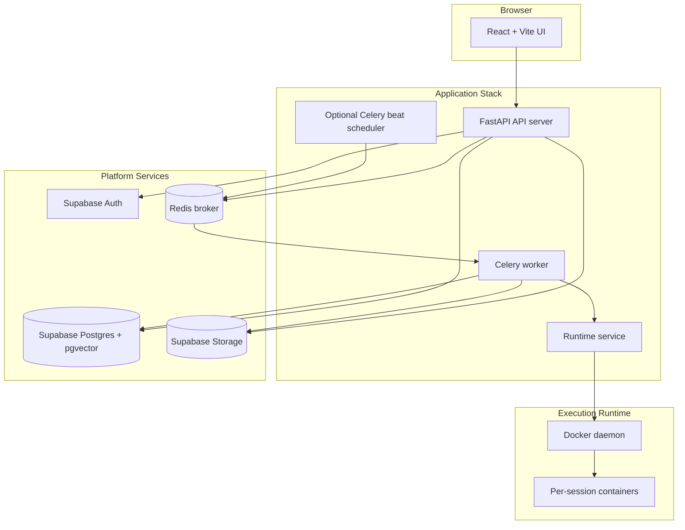
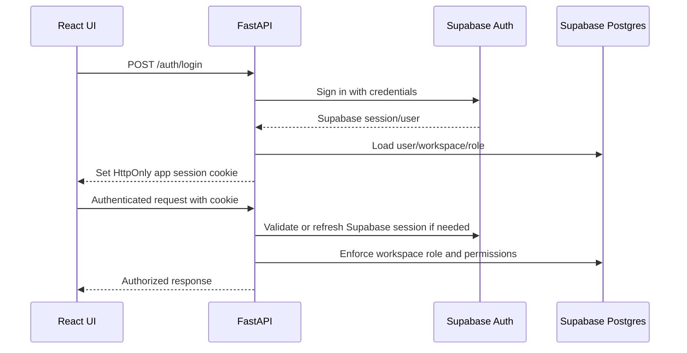
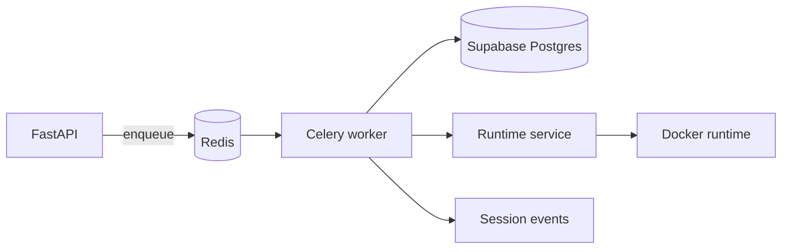

# ScopeForge Tech Stack Decision

## 1. Decision Summary

ScopeForge will use a Python backend, a React/Vite frontend, Supabase for database and authentication, Alembic for migrations, Redis + Celery for background jobs, a separate runtime service with Docker as the first runtime backend, and Docker Compose for the first deployment target.

| Area | Decision |
| --- | --- |
| Backend language | Python |
| Backend API framework | FastAPI |
| Frontend | React + TypeScript + Vite |
| Database | Supabase Postgres |
| Auth | Supabase Auth |
| Migrations | Alembic |
| Queue | Redis + Celery |
| Runtime | Separate runtime service, Docker first |
| Deployment | Docker Compose first |
| Realtime | FastAPI WebSocket from the start |
| Vector memory | Supabase Postgres with pgvector |
| Object/file storage | Supabase Storage initially, local/S3-compatible abstraction later |

## 2. Why This Stack

This stack optimizes for fast implementation while still supporting a serious worker/runtime architecture.

Python gives us a strong AI and agent-development ecosystem. FastAPI gives us typed request/response models, good async support, OpenAPI documentation, and straightforward integration with Supabase Auth. Celery and Redis are mature choices for long-running background work. Supabase gives us managed Postgres, Auth, storage, and pgvector support without forcing us to build every platform service from scratch.

Docker remains the first runtime backend because the product needs isolated tool execution. A separate runtime service owns Docker access so the worker does not need direct Docker socket permissions. Docker Compose remains the first deployment model because it is the simplest way to run the API, frontend, Redis, Celery workers, runtime service, and runtime dependencies locally.

## 3. Architecture Shape



## 4. Backend

### Decision

Use Python with FastAPI.

### Responsibilities

- Backend-mediated authentication using Supabase Auth.
- Session cookie or app-token handling for the frontend.
- REST API for sessions, projects, scopes, providers, policies, evidence, reports, and files.
- Realtime event endpoint using FastAPI WebSocket.
- Database access using SQLAlchemy.
- Migration management using Alembic.
- Celery task enqueueing.
- Admin and operator APIs.

### Suggested Backend Layout

```text
apps/api/
|-- app/
|   |-- main.py
|   |-- config.py
|   |-- api/
|   |-- auth/
|   |-- db/
|   |-- models/
|   |-- schemas/
|   |-- services/
|   |-- policies/
|   |-- realtime/
|   `-- utils/
|-- alembic/
`-- tests/

pyproject.toml lives at the repository root and points package discovery to
`apps/api`.
```

## 5. Frontend

### Decision

Use React + TypeScript + Vite.

### Responsibilities

- Operator dashboard.
- Project and scope management.
- Session workspace.
- Live terminal/log views.
- Approval queue.
- Evidence and finding review.
- Report preview/export UX.
- Settings for provider profiles and policies.

### Suggested Frontend Layout

```text
apps/web/
|-- src/
|   |-- app/
|   |-- pages/
|   |-- features/
|   |-- components/
|   |-- hooks/
|   |-- lib/
|   |-- api/
|   `-- styles/
|-- public/
|-- package.json
`-- vite.config.ts
```

## 6. Database

### Decision

Use Supabase Postgres as the primary database.

### Notes

Supabase is Postgres, so the relational schema in [Database Design](DATABASE_DESIGN.md) still applies. The main difference is operational: Supabase provides hosting, connection management, Auth integration, storage, and pgvector support.

The app should still treat the database as a normal Postgres database from the backend. Business logic should live in the API and worker, not in Supabase client calls scattered across the frontend.

### Database Access

Decision:

- Use sync SQLAlchemy 2.x for the ORM/query layer.
- Alembic for migrations.
- Use FastAPI dependency-managed synchronous database sessions for API requests.
- Use explicit synchronous database sessions inside Celery tasks.
- Explicit repository/service layer for complex queries.

Rationale:

- Celery workers are naturally synchronous, and most heavy database work will happen in workers.
- Sync SQLAlchemy is simpler to reason about and debug during the early build.
- FastAPI can safely run sync route handlers through threadpool boundaries.
- WebSocket endpoints should avoid heavy database loops; they can consume lightweight event polling, Redis pub/sub, or a dedicated internal event feed.

Async SQLAlchemy can be introduced later for specific high-concurrency paths if profiling proves it is needed.

### Supabase Client Usage Boundary

Decision:

- Use the Supabase Python client only inside backend infrastructure adapters.
- Use it for Supabase Auth operations.
- Use it for Supabase Storage operations.
- Do not use Supabase client table helpers for application data.
- Do not use Supabase client directly in the frontend.
- Use SQLAlchemy for all application database reads and writes.

Allowed Supabase client usage:

```text
backend auth adapter -> Supabase Auth
backend storage adapter -> Supabase Storage
```

Disallowed Supabase client usage:

```text
frontend -> Supabase Auth
frontend -> Supabase database
frontend -> Supabase Storage, except signed URLs issued by backend
backend services -> Supabase table helpers for product tables
workers -> Supabase table helpers for product tables
```

Rationale:

- The backend remains the control plane for auth, authorization, audit, and policy.
- Business logic stays in backend services instead of leaking into frontend Supabase calls.
- SQLAlchemy keeps database access consistent across API routes, Celery workers, tests, and migrations.
- Storage and Auth can still use Supabase's managed platform capabilities safely behind backend adapters.

## 7. Authentication

### Decision

Use Supabase Auth behind the backend.

The frontend must request authentication through the FastAPI backend. The frontend should not talk directly to Supabase Auth for login, logout, refresh, password reset, OAuth callbacks, or session verification.

### Responsibilities

Supabase Auth handles:

- User identity.
- Credential verification.
- Supabase user/session token issuance behind the backend boundary.
- OAuth providers later if needed.
- Password reset and account flows.

The backend handles:

- Login, logout, refresh, callback, and current-user API routes.
- Calling Supabase Auth through the Supabase Python client or Auth API wrapper.
- Mapping Supabase user IDs to local workspace users.
- Setting and clearing the frontend-facing session cookie or app session token.
- Supabase JWT verification where tokens are used internally.
- Workspace membership checks.
- Role and permission checks.
- API authorization.
- Audit events.

Recommended frontend-facing session model:

- The frontend posts credentials or OAuth intent to FastAPI.
- FastAPI talks to Supabase Auth.
- FastAPI sets an `HttpOnly`, `Secure`, `SameSite` cookie for the browser.
- The frontend calls the backend with normal credentialed requests.
- The backend refreshes or validates the Supabase session as needed.
- The frontend never stores raw Supabase refresh tokens.
- General application data must still use SQLAlchemy, not Supabase client table helpers.



## 8. Queue and Workers

### Decision

Use Redis + Celery.

### Responsibilities

Celery workers handle:

- Session planning jobs.
- Session execution jobs.
- Tool execution orchestration.
- Report generation.
- Memory embedding jobs.
- Cleanup jobs.

Redis handles:

- Broker messages.
- Short-lived coordination data.

Celery result storage is not the product source of truth. Workers should update our own SQLAlchemy-managed job, session, step, tool call, evidence, report, and event tables as work progresses. Redis may hold short-lived delivery and coordination state, but durable status, progress, logs, outputs, and audit history must live in Supabase Postgres.

### Job State Source of Truth

Use our own Postgres job/run tables for product-visible background work state.

Do not use Celery result rows as the canonical record for:

- Job status.
- Job progress.
- Worker errors.
- Agent step outputs.
- Tool execution outputs.
- Evidence generation.
- Report generation.
- Audit history.

Celery task ids can be stored as correlation metadata, but product workflows should be recoverable from Postgres records even if Redis is flushed.



## 9. Runtime

### Decision

Use a separate runtime service with Docker as the first runtime backend.

The Celery worker should call the runtime service through an internal API or client interface. The worker should not be designed around direct access to `/var/run/docker.sock`.

### Responsibilities

- Start per-session containers.
- Mount session workspace.
- Execute terminal commands.
- Read/write files inside the workspace.
- Stream stdout/stderr.
- Enforce timeout and cleanup.
- Collect artifacts and evidence.

The runtime service owns Docker access, runtime policy enforcement, container lifecycle, command execution, workspace mounts, artifact collection, and cleanup. If early local development uses direct Docker access, it must live inside the runtime service or a runtime adapter, not inside business workflow code.

The runtime should be wrapped behind a Python interface so that Kubernetes, Firecracker, or remote runners can be added later.

```text
RuntimeManager
  start_session_runtime(session_id)
  execute_command(runtime_id, command, timeout)
  write_file(runtime_id, path, content)
  read_file(runtime_id, path)
  list_files(runtime_id, path)
  stop_runtime(runtime_id)
```

## 10. Deployment

### Decision

Use Docker Compose first for application services, connected to hosted Supabase.

Initial local services:

- `web`
- `api`
- `worker`
- `runtime`
- `redis`
- optional `flower` for Celery monitoring
- optional Docker socket mount on the runtime service only

Supabase decision:

- Use a hosted Supabase project first for local development.
- Connect local API and worker services to hosted Supabase Postgres, Supabase Auth, and Supabase Storage through environment variables.
- Run Alembic migrations against the hosted Supabase database during the first development phase.
- Do not require the local Supabase stack for the initial developer loop.
- Add local Supabase later only if offline development, isolated integration tests, or self-hosted parity becomes important.

Required local environment shape:

```text
SUPABASE_URL=...
SUPABASE_ANON_KEY=...
SUPABASE_SERVICE_ROLE_KEY=...
DATABASE_URL=postgresql+psycopg://...
REDIS_URL=redis://redis:6379/0
RUNTIME_SERVICE_URL=http://runtime:...
```

## 11. Realtime

### Decision

Use FastAPI WebSocket from the start.

Recommendation:

- Use WebSocket for session events, terminal output, progress updates, approval state, and future bidirectional runtime interactions.
- Keep event persistence in Postgres so reconnect and replay do not depend on an in-memory socket connection.
- Use a simple channel model first, such as `/ws/sessions/{session_id}` and optional workspace-level feeds later.

Session events should be persisted in Postgres first, then streamed to clients. This allows reconnect and replay.

## 12. File and Artifact Storage

### Decision

Use Supabase Storage initially, through the backend.

The backend should own file authorization and metadata. The frontend should not directly bypass the backend for security-sensitive evidence or report files unless we intentionally issue signed URLs.

Use the Supabase Python client for Storage operations, wrapped behind our own storage adapter. Application metadata stays in Postgres through SQLAlchemy.

Storage adapter interface:

```text
Storage.put(key, bytes, metadata)
Storage.get(key)
Storage.delete(key)
Storage.signed_url(key, ttl)
```

## 13. Implications for Existing Docs

This decision affects:

- [Architecture](ARCHITECTURE.md): Python/FastAPI, Celery, Supabase, Redis, Docker.
- [Database Design](DATABASE_DESIGN.md): Supabase Postgres remains the database, Alembic becomes migration tooling.
- [Project Phases](PROJECT_PHASES.md): Phase 0 stack decision is now complete unless we revisit it.
- Future API design: should assume FastAPI REST plus WebSocket realtime endpoints.
- Future agent/tool design: should assume Python worker services.
- Future runtime design: should assume a separate runtime service boundary, with Docker as the first backend.

## 14. Open Technical Questions

No open stack-level technical questions remain.
