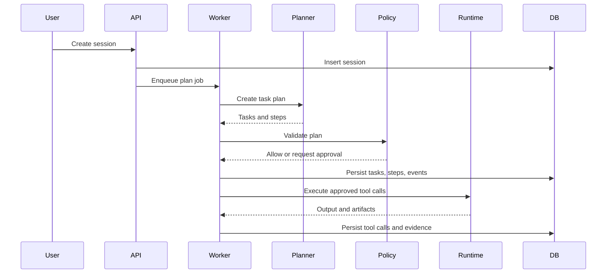
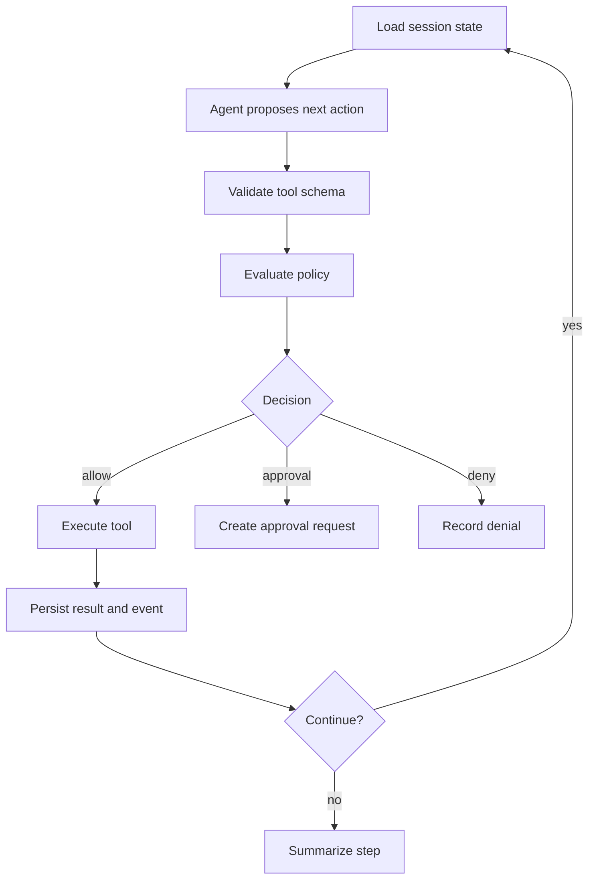
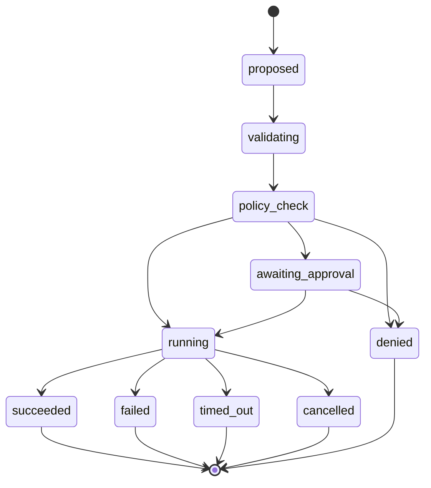
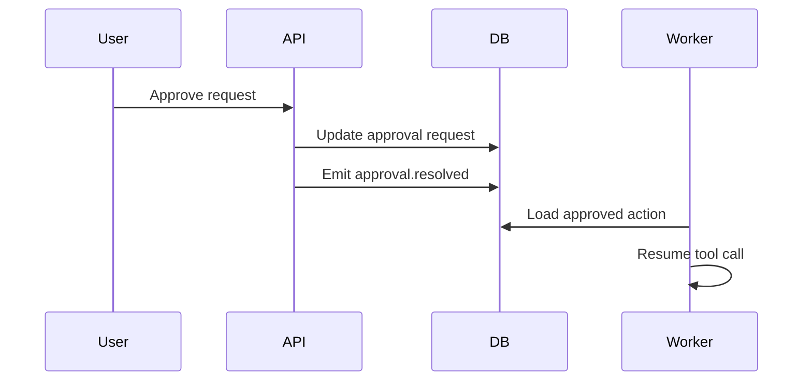

# ScopeForge Agent and Tool Design

## 1. Purpose

This document defines how ScopeForge agents, tools, policy checks, approvals, runtime execution, evidence capture, and reporting fit together.

The product should feel autonomous, but the implementation must remain inspectable, policy-controlled, and recoverable.

## 2. Goals

- Define clear agent roles.
- Keep tool calls structured and auditable.
- Keep policy outside prompts.
- Require human approval when policy says so.
- Persist useful messages, summaries, tool calls, evidence, and reports.
- Support multiple LLM providers through adapters.

## 3. Non-Goals

- Do not hard-code one provider.
- Do not store private hidden chain-of-thought.
- Do not let prompts override policy.
- Do not let agents execute arbitrary tools without registry validation.
- Do not treat raw terminal output as automatically trusted evidence.

## 4. Agent Roles

Initial roles:

| Role | Responsibility |
| --- | --- |
| Planner | Convert objective and scope into tasks and steps |
| Executor | Choose next approved action for a step |
| Researcher | Read docs, prior evidence, and context |
| Coder | Create scripts or parsers inside runtime limits |
| Reporter | Convert findings and evidence into report sections |
| Supervisor | Watch quality, budget, loops, and policy risk |

Roles are logical. The first implementation can run them in one worker process.

## 5. High-Level Flow



## 6. Agent Loop



## 7. Tool Registry

Every tool must be registered before an agent can call it.

Tool definition:

```json
{
  "name": "terminal.execute",
  "version": "1.0.0",
  "description": "Execute an approved command in the session runtime.",
  "risk_level": "medium",
  "runtime_type": "container",
  "input_schema": {},
  "output_schema": {},
  "default_timeout_seconds": 300
}
```

Registry rules:

- Tool names are stable identifiers.
- Tool input and output use JSON Schema.
- Risk level is mandatory.
- Disabled tools cannot be selected by agents.
- Tool versions should be recorded on every `tool_calls` row.

## 8. Tool Categories

Initial categories:

| Category | Examples |
| --- | --- |
| Session | Read session, update step summary |
| Runtime | Execute command, read file, write file, list files |
| Evidence | Create evidence item, attach artifact |
| Research | Search approved docs or memory |
| Reporting | Draft report section, update report |
| Approval | Request human approval |

Security testing tools must be wrapped behind policy-aware tool definitions. The agent should not call arbitrary binaries by name unless the terminal tool and policy allow it.

## 9. Tool Call Lifecycle



Persist each tool call in `tool_calls` with:

- Tool name and version.
- Validated arguments.
- Policy decision.
- Status and timestamps.
- Structured result.
- Truncated raw output if useful.
- Linked evidence items.

## 10. Provider Adapter Interface

LLM providers should sit behind a common adapter:

```text
ProviderClient
  complete(request) -> response
  stream(request) -> event iterator
  count_tokens(messages) -> token_count
```

Provider request fields:

```text
model
messages
tools
temperature
max_tokens
response_format
metadata
```

Rules:

- Provider-specific details stay in adapters.
- Store provider name, model, token counts, and cost metadata.
- Avoid storing provider-private reasoning.
- Store visible output and safe summaries.

## 11. Memory and Context

Context sources:

- Session objective.
- Scope and policy.
- Project notes.
- Prior session summaries.
- Evidence metadata.
- Approved memory documents.
- Current task and step state.

Context rules:

- Scope and policy are structured data, not just prompt text.
- Memory retrieval must be workspace-scoped.
- Sensitive secrets should not be injected into prompts unless explicitly required and allowed.
- Agent context should include enough audit identifiers to trace outputs.

## 12. Approval Integration

When policy returns `require_approval`:

- Worker creates `approval_requests`.
- Tool call moves to `awaiting_approval`.
- Session event `approval.requested` is emitted.
- WebSocket clients show the pending decision.
- Worker pauses that action until approval is resolved.

Approval response:



## 13. Evidence Creation

Evidence must be linked to source actions.

Evidence can come from:

- Tool outputs.
- Files produced inside runtime.
- Screenshots or logs.
- Agent summaries.
- User-uploaded context.

Evidence rules:

- Store artifact bytes in Supabase Storage through backend adapters.
- Store metadata in Postgres.
- Link evidence to session, task, step, and tool call where possible.
- Preserve enough context to review how the evidence was produced.

## 14. Job Model

Celery executes work, but Postgres records product state.

Common job types:

- `plan_session`
- `run_session`
- `execute_step`
- `render_report`
- `embed_memory`
- `cleanup_runtime`

Rules:

- `jobs` is the source of truth for job status.
- Celery task id is correlation metadata only.
- Workers update domain tables as work progresses.
- Retry rules must be bounded.

## 15. Agent Guardrails

- Policy decisions are not delegated to the model.
- Tool schema validation happens before policy.
- Runtime execution happens only after policy allows or approval resolves.
- Budget limits stop or pause loops.
- Supervisor checks repeated failures and low-quality loops.
- Human operators can pause, stop, or archive sessions.

## 16. Implementation Checklist

- Define agent role enum.
- Define provider adapter interface.
- Define tool registry loader.
- Define tool input/output schemas.
- Implement tool call state machine.
- Implement policy integration point.
- Implement approval pause/resume.
- Implement runtime tool adapters.
- Implement evidence creation service.
- Implement report generation job.
- Add unit tests for state transitions and policy outcomes.
