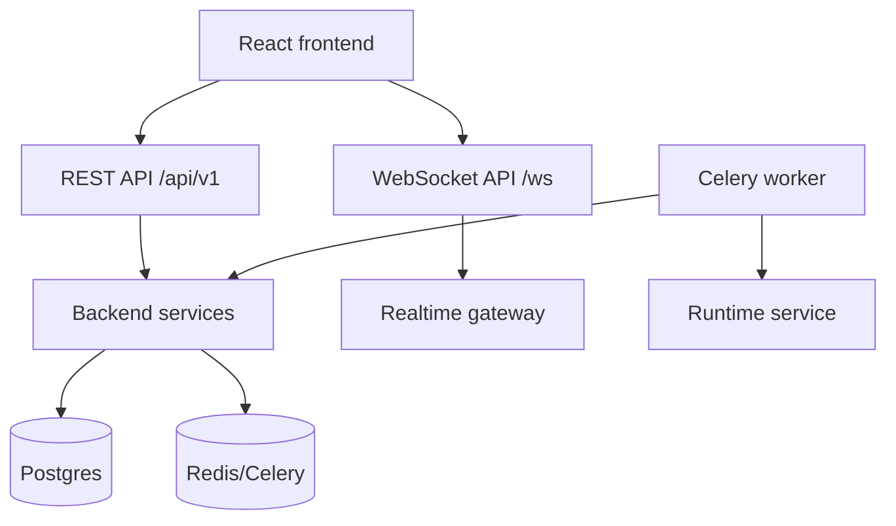

# ScopeForge API Design

## 1. Purpose

This document defines the first API contract for ScopeForge.

The API should be stable enough for frontend, worker, runtime, and future SDK work while staying simple for the first implementation.

## 2. Locked Decisions

- Backend framework: FastAPI.
- Primary external API style: REST.
- Realtime transport: FastAPI WebSocket from the start.
- Auth boundary: frontend talks to backend; backend talks to Supabase Auth.
- Database access: sync SQLAlchemy.
- Background jobs: Redis + Celery, with product state in Postgres job/domain tables.
- Runtime: worker calls separate runtime service.

## 3. API Surface



## 4. Versioning

Use path versioning:

```text
/api/v1/...
/ws/v1/...
```

Rules:

- Do not break existing request or response fields inside a version.
- Add optional fields before creating a new version.
- Keep internal worker/runtime APIs separate from public browser APIs.

## 5. Authentication

Browser requests use backend session cookies.

```text
Cookie: app_session=...
X-CSRF-Token: ...
```

API token requests use:

```text
Authorization: Bearer <token>
```

Protected endpoints must resolve an `AuthContext` before running route logic.

## 6. Standard Response Shape

Success responses should be direct and typed.

Example:

```json
{
  "id": "session-id",
  "status": "running",
  "title": "External perimeter review"
}
```

List responses use a consistent envelope:

```json
{
  "items": [],
  "page": {
    "limit": 50,
    "next_cursor": "opaque-cursor",
    "has_more": false
  }
}
```

Error responses use a consistent envelope:

```json
{
  "error": {
    "code": "permission_denied",
    "message": "You do not have permission to approve this session.",
    "details": {},
    "request_id": "req_..."
  }
}
```

## 7. Error Codes

| Code | HTTP Status | Meaning |
| --- | --- | --- |
| `unauthenticated` | 401 | Missing or invalid auth |
| `permission_denied` | 403 | Authenticated but not allowed |
| `not_found` | 404 | Resource missing or hidden by workspace boundary |
| `validation_error` | 422 | Request failed schema validation |
| `conflict` | 409 | State transition conflict |
| `rate_limited` | 429 | Rate or budget exceeded |
| `policy_denied` | 403 | Security policy denied the action |
| `approval_required` | 409 | Action requires human approval |
| `runtime_unavailable` | 503 | Runtime service unavailable |
| `internal_error` | 500 | Unexpected backend error |

## 8. Pagination and Filtering

Use cursor pagination for large lists.

Common query params:

```text
limit=50
cursor=...
sort=-created_at
status=running
project_id=...
q=...
```

Rules:

- Default `limit` should be 50.
- Hard maximum should be 200 for normal lists.
- Sort fields must be allowlisted.
- Search must be workspace-scoped.

## 9. Core REST Endpoints

### Auth

| Method | Path | Purpose |
| --- | --- | --- |
| `POST` | `/api/v1/auth/login` | Sign in through backend/Supabase |
| `POST` | `/api/v1/auth/logout` | Revoke backend session |
| `POST` | `/api/v1/auth/refresh` | Refresh backend session |
| `GET` | `/api/v1/auth/me` | Current user, workspace, permissions |
| `POST` | `/api/v1/auth/password-reset` | Start password reset |
| `POST` | `/api/v1/auth/oauth/:provider/start` | Start OAuth |
| `GET` | `/api/v1/auth/oauth/:provider/callback` | OAuth callback |

### Workspaces and Users

| Method | Path | Purpose |
| --- | --- | --- |
| `GET` | `/api/v1/workspaces` | List accessible workspaces |
| `GET` | `/api/v1/workspaces/:id` | Workspace details |
| `PATCH` | `/api/v1/workspaces/:id` | Update settings |
| `GET` | `/api/v1/workspaces/:id/users` | List users |
| `POST` | `/api/v1/workspaces/:id/invitations` | Invite user |
| `PATCH` | `/api/v1/workspaces/:id/users/:user_id` | Update role/status |

### Projects and Scope

| Method | Path | Purpose |
| --- | --- | --- |
| `GET` | `/api/v1/projects` | List projects |
| `POST` | `/api/v1/projects` | Create project |
| `GET` | `/api/v1/projects/:id` | Project details |
| `PATCH` | `/api/v1/projects/:id` | Update project |
| `GET` | `/api/v1/projects/:id/scopes` | List scopes |
| `POST` | `/api/v1/projects/:id/scopes` | Create scope |
| `PATCH` | `/api/v1/scopes/:id` | Update scope |

### Sessions

| Method | Path | Purpose |
| --- | --- | --- |
| `GET` | `/api/v1/sessions` | List sessions |
| `POST` | `/api/v1/sessions` | Create session |
| `GET` | `/api/v1/sessions/:id` | Session detail |
| `POST` | `/api/v1/sessions/:id/start` | Start execution |
| `POST` | `/api/v1/sessions/:id/pause` | Pause session |
| `POST` | `/api/v1/sessions/:id/resume` | Resume session |
| `POST` | `/api/v1/sessions/:id/stop` | Stop session |
| `POST` | `/api/v1/sessions/:id/archive` | Archive session |
| `GET` | `/api/v1/sessions/:id/events` | Replay durable events |
| `GET` | `/api/v1/sessions/:id/tasks` | List tasks and steps |

### Approvals

| Method | Path | Purpose |
| --- | --- | --- |
| `GET` | `/api/v1/approvals` | List pending approvals |
| `GET` | `/api/v1/approvals/:id` | Approval detail |
| `POST` | `/api/v1/approvals/:id/approve` | Approve requested action |
| `POST` | `/api/v1/approvals/:id/deny` | Deny requested action |

### Tools, Evidence, and Reports

| Method | Path | Purpose |
| --- | --- | --- |
| `GET` | `/api/v1/tools` | List available tools |
| `GET` | `/api/v1/sessions/:id/tool-calls` | List tool calls |
| `GET` | `/api/v1/sessions/:id/evidence` | List evidence |
| `GET` | `/api/v1/evidence/:id` | Evidence detail |
| `GET` | `/api/v1/evidence/:id/file` | Signed or proxied file download |
| `GET` | `/api/v1/sessions/:id/reports` | List reports |
| `POST` | `/api/v1/sessions/:id/reports` | Generate report |
| `GET` | `/api/v1/reports/:id/export` | Export report |

## 10. Session Creation Contract

Request:

```json
{
  "project_id": "project-id",
  "scope_id": "scope-id",
  "policy_id": "policy-id",
  "provider_profile_id": "provider-profile-id",
  "title": "External perimeter review",
  "objective": "Assess the approved staging perimeter.",
  "mode": "assisted"
}
```

Response:

```json
{
  "id": "session-id",
  "status": "draft",
  "title": "External perimeter review",
  "created_at": "2026-06-16T00:00:00Z"
}
```

## 11. WebSocket API

Primary session channel:

```text
/ws/v1/sessions/{session_id}
```

Optional workspace channel later:

```text
/ws/v1/workspaces/{workspace_id}
```

Connection rules:

- Authenticate with the same backend session cookie.
- Verify workspace membership before accepting.
- Accept optional `last_event_id` query param for replay.
- Send missed events from `session_events` after connect.
- Close with a typed error message on permission failure.

## 12. WebSocket Message Envelope

Server-to-client:

```json
{
  "type": "session.event",
  "event_id": "12345",
  "session_id": "session-id",
  "event_type": "tool_call.started",
  "created_at": "2026-06-16T00:00:00Z",
  "payload": {}
}
```

Client-to-server:

```json
{
  "type": "session.command",
  "request_id": "client-generated-id",
  "command": "pause_session",
  "payload": {}
}
```

Acknowledgement:

```json
{
  "type": "command.ack",
  "request_id": "client-generated-id",
  "status": "accepted"
}
```

## 13. Realtime Event Types

Initial event types:

| Event Type | Purpose |
| --- | --- |
| `session.created` | Session created |
| `session.status_changed` | Session state changed |
| `task.created` | Task created |
| `task.updated` | Task status/details changed |
| `step.started` | Step started |
| `step.finished` | Step finished |
| `agent.message` | Visible agent message or summary |
| `tool_call.started` | Tool invocation started |
| `tool_call.output` | Output chunk or summary |
| `tool_call.finished` | Tool invocation ended |
| `approval.requested` | Human decision needed |
| `approval.resolved` | Human decision made |
| `evidence.created` | Evidence item created |
| `report.updated` | Report generation/edit updated |
| `job.updated` | Background job progress changed |

## 14. Idempotency

Use an `Idempotency-Key` header for mutating endpoints that can be retried:

- Create session.
- Start session.
- Generate report.
- Approve or deny approval.
- Create invitation.

The backend should store request hash, response summary, user, workspace, and expiration.

## 15. Internal API Boundaries

Public browser API:

- Authenticated through cookies.
- Workspace-scoped.
- Strong validation and permission checks.

Worker-facing service functions:

- Prefer Python service calls inside the same backend package.
- If exposed over HTTP later, use internal network auth.

Runtime service API:

- Internal only.
- Not browser-accessible.
- Owned by `RUNTIME_SERVICE_DESIGN.md`.

## 16. Testing Contract

Required tests:

- Auth required for protected endpoints.
- Workspace isolation.
- Permission denial.
- Session state transitions.
- Approval approve/deny behavior.
- WebSocket auth and replay.
- Error envelope consistency.
- Pagination cursor stability.
