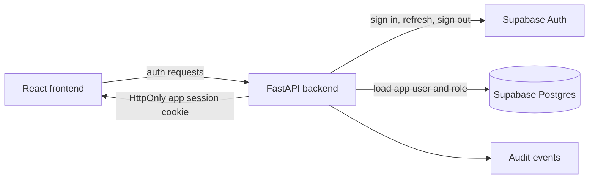
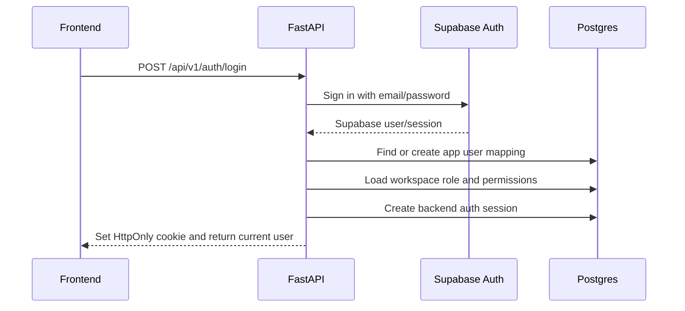
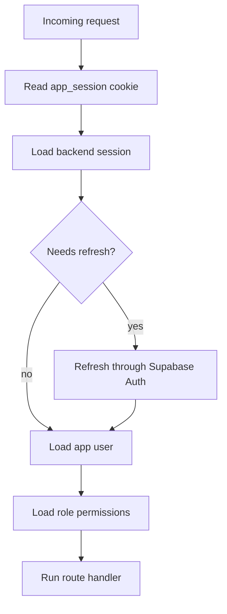
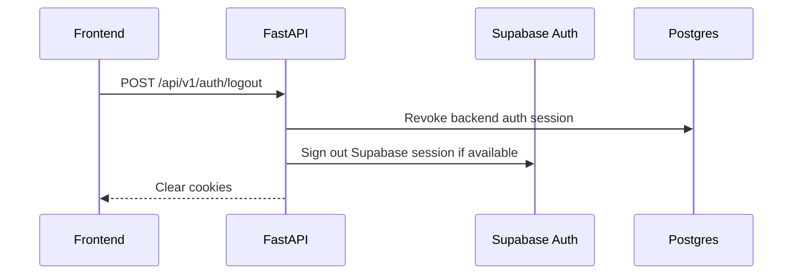
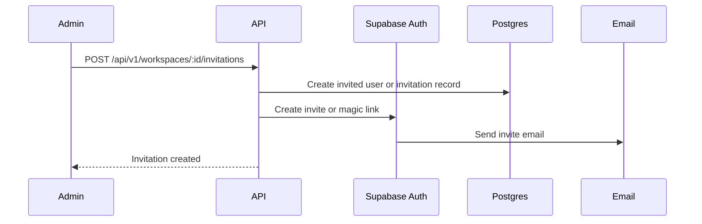

# ScopeForge Auth Design

## 1. Purpose

This document defines authentication and authorization flow for ScopeForge.

The key decision is already locked:

- The frontend talks to the backend for auth.
- The backend talks to Supabase Auth.
- The frontend does not call Supabase Auth directly.
- Application authorization lives in the backend and database, not in frontend checks.

## 2. Goals

- Keep Supabase Auth behind backend-owned routes.
- Keep Supabase tokens out of browser JavaScript.
- Support workspace-aware authorization.
- Make user, role, session, and audit behavior explicit.
- Keep the first implementation simple enough for Docker Compose and hosted Supabase.

## 3. Non-Goals

- Do not build a custom password system.
- Do not expose Supabase service role keys to the frontend.
- Do not rely on frontend role checks for security.
- Do not use Supabase table helpers for product data.
- Do not require local Supabase for the first developer loop.

## 4. System Boundary



The frontend only sees application auth state returned by the backend. It should never hold Supabase access tokens in local storage, session storage, or ordinary JavaScript variables.

## 5. Identity Model

Supabase Auth owns primary identity verification.

The application database owns product identity and authorization:

| Concept | Owner | Notes |
| --- | --- | --- |
| Email/password verification | Supabase Auth | Backend calls Supabase Auth |
| OAuth identity | Supabase Auth | Backend handles callback flow |
| App user profile | Postgres `users` | Workspace-scoped app identity |
| Role and permissions | Postgres `roles`, `role_permissions` | Backend enforced |
| API tokens | Postgres `api_tokens` | Hashed token storage only |
| Session cookie | Backend | HttpOnly cookie |
| Audit history | Postgres audit tables/events | Backend writes |

Database dependencies:

- Add `supabase_user_id uuid` to `users`.
- Add a unique index on `(workspace_id, supabase_user_id)` where `deleted_at is null`.
- Add `auth_sessions` for backend-owned browser sessions and server-side revocation.

## 6. Session Strategy

Use backend-owned HttpOnly cookies.

Recommended first implementation:

- `app_session`: opaque backend session id.
- `app_csrf`: non-HttpOnly CSRF token for unsafe requests.
- Store session metadata in `auth_sessions`.
- Store Supabase refresh token encrypted server-side if persistent refresh is needed.

Cookie settings:

| Setting | Value |
| --- | --- |
| `HttpOnly` | true for `app_session` |
| `Secure` | true outside local HTTP development |
| `SameSite` | `Lax` initially |
| `Path` | `/` |
| TTL | short access window with refresh support |

## 7. Login Flow



Login response body should include safe app state only:

```json
{
  "user": {
    "id": "app-user-id",
    "email": "operator@example.com",
    "name": "Operator",
    "workspace_id": "workspace-id",
    "role": "Operator",
    "permissions": ["sessions.create", "sessions.read"]
  }
}
```

## 8. Request Authentication

Every protected backend request follows the same path:



Backend request context should expose:

```text
AuthContext
  user_id
  supabase_user_id
  workspace_id
  role_id
  permissions
  auth_session_id
  request_id
```

## 9. Authorization Model

Authorization is permission-based, with roles as bundles of permissions.

Example permissions:

| Permission | Allows |
| --- | --- |
| `workspaces.manage` | Manage workspace settings |
| `users.invite` | Invite users |
| `projects.create` | Create projects |
| `sessions.create` | Start sessions |
| `sessions.run` | Execute session work |
| `sessions.approve` | Resolve approval gates |
| `evidence.read` | View evidence |
| `reports.export` | Export reports |
| `policies.manage` | Edit policies |
| `providers.manage` | Configure providers |

Authorization checks should happen in backend services before data access or state mutation.

## 10. Workspace Resolution

Initial implementation should use one active workspace per request.

Workspace can be resolved by:

- Active workspace stored on the backend session.
- Explicit `X-Workspace-Id` header after the user has selected a workspace.
- URL-scoped resources where the resource id implies workspace ownership.

Rules:

- Never trust a workspace id without checking membership.
- Never return cross-workspace data.
- Admin routes still require workspace membership unless they are platform-superadmin routes.

## 11. Logout Flow



Logout must be idempotent. Calling logout with an already expired session should still clear cookies and return success.

## 12. Invite Flow



Invitation rules:

- Only users with `users.invite` can invite.
- Invitations must be workspace-scoped.
- Invited role must be assignable by the inviter.
- Expired invitations must not create active users.

## 13. Password Reset and OAuth

Password reset:

- Frontend submits email to backend.
- Backend calls Supabase Auth password reset API.
- Callback lands on backend or frontend route with a backend-mediated finalization step.

OAuth:

- Frontend starts OAuth through backend.
- Backend creates provider redirect URL through Supabase Auth.
- Callback is handled by backend or a frontend route that immediately calls backend.
- Backend creates or links the app user record after callback verification.

## 14. API Tokens

API tokens are separate from human login.

Rules:

- Store only token hashes.
- Show the raw token only once.
- Bind tokens to `workspace_id`, `user_id`, scopes, and expiration.
- API tokens cannot use Supabase Auth directly.
- API token requests still use the same authorization services after token verification.

## 15. Security Controls

- Require CSRF protection for cookie-authenticated unsafe methods.
- Rotate backend session ids after login.
- Expire sessions after inactivity.
- Log login, logout, refresh failure, invitation, role change, and token creation.
- Rate-limit login and password reset endpoints.
- Never log Supabase tokens, refresh tokens, cookies, or service role keys.

## 16. Implementation Checklist

- Create backend auth adapter for Supabase Auth.
- Create backend session manager.
- Add auth middleware/dependency.
- Add permission guard helper.
- Add CSRF protection for cookie sessions.
- Add auth routes.
- Add user/workspace bootstrap logic.
- Add audit events for auth-sensitive changes.
- Add tests for login, logout, refresh, workspace switching, and permission denial.
