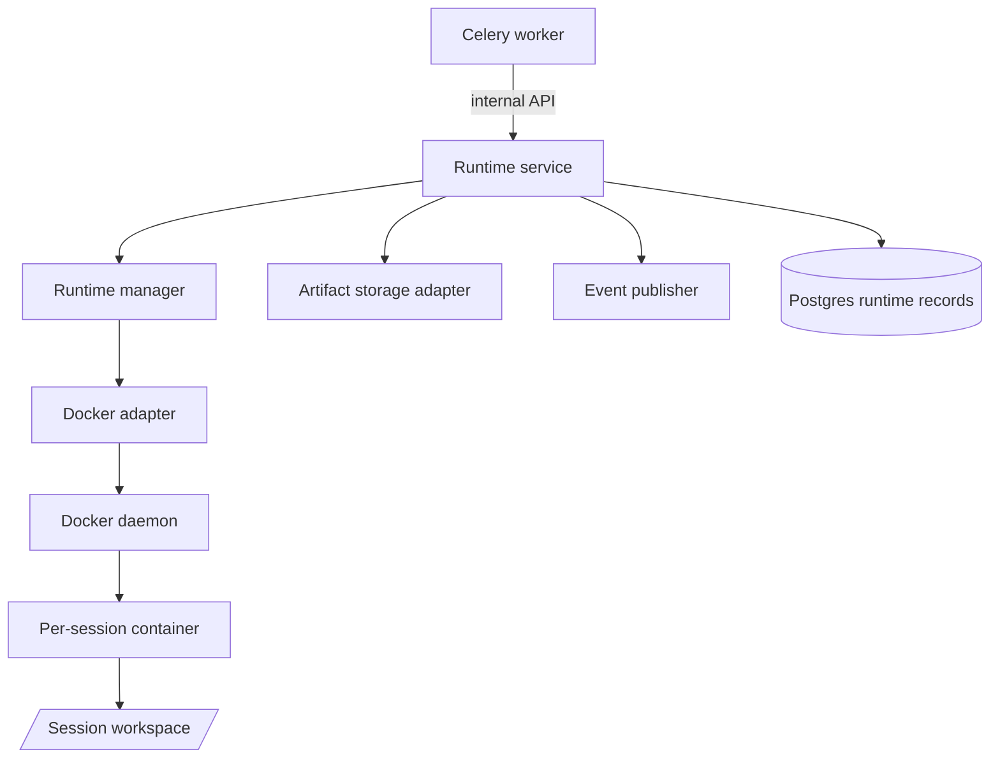
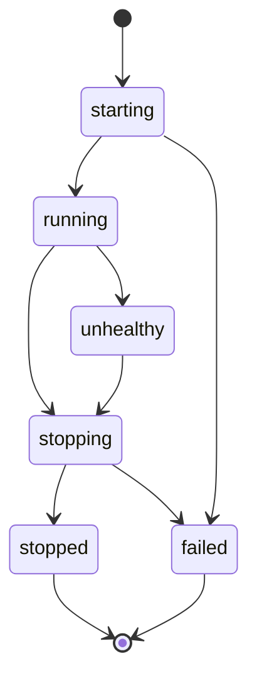
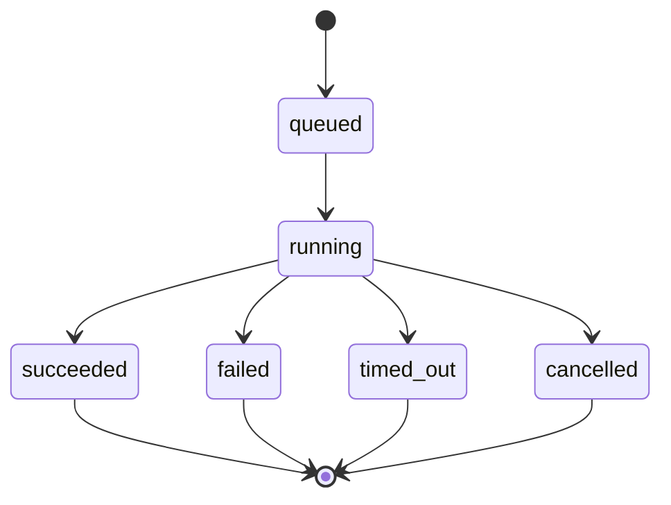
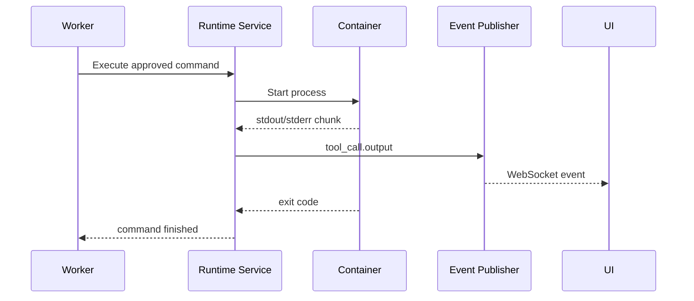

# ScopeForge Runtime Service Design

## 1. Purpose

The ScopeForge runtime service owns isolated execution.

Locked decision:

```text
Worker -> Runtime service -> Docker daemon -> sandbox containers
```

The Celery worker must not mount or directly use `/var/run/docker.sock`. Docker access belongs to the runtime service.

## 2. Goals

- Provide an internal API for sandbox lifecycle and execution.
- Keep Docker privileges out of worker business logic.
- Enforce runtime-level file, command, network, timeout, and cleanup boundaries.
- Support Docker first while leaving room for Kubernetes, Firecracker, or remote runners later.
- Emit output and artifact metadata back to the application.

## 3. Non-Goals

- Do not expose runtime APIs to browsers.
- Do not make the runtime service decide high-level business policy.
- Do not let agents access host files directly.
- Do not run unapproved actions.
- Do not make Docker-specific details leak into session orchestration.

## 4. Architecture



## 5. Runtime Service Responsibilities

- Start runtime instances.
- Stop runtime instances.
- Execute approved commands.
- Read, write, and list files inside the session workspace.
- Stream command output.
- Collect artifacts.
- Enforce per-command timeouts.
- Enforce resource limits.
- Cleanup stale containers and workspaces.
- Maintain runtime health state.

## 6. Ownership Split

| Concern | Owner |
| --- | --- |
| User auth and permissions | API backend |
| Agent planning and tool selection | Worker |
| High-level policy decision | Policy engine |
| Docker socket access | Runtime service |
| Container lifecycle | Runtime service |
| Workspace file boundaries | Runtime service |
| Command output streaming | Runtime service |
| Evidence records | Worker/backend service |
| Artifact bytes | Runtime service through storage adapter |

## 7. Internal API

All endpoints are internal and should be reachable only from trusted application services.

### Health

```text
GET /internal/runtime/health
```

Response:

```json
{
  "status": "ok",
  "docker_available": true,
  "active_runtimes": 3
}
```

### Start Runtime

```text
POST /internal/runtime/instances
```

Request:

```json
{
  "workspace_id": "workspace-id",
  "session_id": "session-id",
  "runtime_profile": "default-python-tools",
  "network_policy": {
    "mode": "restricted",
    "allowed_hosts": ["approved.example.com"]
  },
  "resource_limits": {
    "cpu": "2",
    "memory_mb": 4096,
    "disk_mb": 10240
  }
}
```

Response:

```json
{
  "runtime_id": "runtime-id",
  "status": "starting",
  "workspace_path": "/workspace"
}
```

### Execute Command

```text
POST /internal/runtime/instances/{runtime_id}/commands
```

Request:

```json
{
  "tool_call_id": "tool-call-id",
  "command": ["python", "script.py"],
  "cwd": "/workspace",
  "env": {},
  "timeout_seconds": 300,
  "max_output_bytes": 1048576,
  "policy_decision_id": "policy-decision-id"
}
```

Response:

```json
{
  "command_id": "runtime-command-id",
  "status": "running"
}
```

### Command Status

```text
GET /internal/runtime/commands/{command_id}
```

Response:

```json
{
  "command_id": "runtime-command-id",
  "status": "succeeded",
  "exit_code": 0,
  "duration_ms": 1200,
  "output_truncated": false
}
```

### Cancel Command

```text
POST /internal/runtime/commands/{command_id}/cancel
```

### File Operations

```text
GET  /internal/runtime/instances/{runtime_id}/files?path=/workspace
GET  /internal/runtime/instances/{runtime_id}/files/content?path=/workspace/file.txt
PUT  /internal/runtime/instances/{runtime_id}/files/content
POST /internal/runtime/instances/{runtime_id}/artifacts
```

File operation rules:

- Paths must resolve inside the session workspace.
- Symlink traversal outside workspace must be rejected.
- File reads and writes must have size limits.
- Binary downloads should use storage-backed artifacts instead of large JSON responses.

### Stop Runtime

```text
POST /internal/runtime/instances/{runtime_id}/stop
```

Request:

```json
{
  "reason": "session_completed",
  "collect_artifacts": true
}
```

## 8. Runtime States



Runtime state should be reflected in `runtime_instances`.

## 9. Command States



Command state should be reflected through `tool_calls` and runtime command metadata.

## 10. Output Streaming

Runtime command output should flow back to the app as events:



Rules:

- Output chunks must have maximum size.
- Secrets should be masked before persistence or UI delivery where possible.
- Very large output should be truncated and saved as an artifact if needed.

## 11. Workspace Layout

Recommended container workspace:

```text
/workspace/
  input/
  output/
  artifacts/
  scripts/
  tmp/
```

Rules:

- `/workspace` is the only writable mount.
- Runtime service controls host-side workspace mapping.
- Containers should not mount project source code or host secrets.
- Cleanup should remove transient workspace data according to retention policy.

## 12. Docker Adapter Requirements

Docker first does not mean Docker everywhere in the app.

Adapter responsibilities:

- Create container with runtime profile image.
- Apply CPU, memory, disk, process, and timeout controls where available.
- Apply network mode and DNS restrictions where available.
- Mount only the session workspace.
- Execute commands with controlled environment variables.
- Stop and remove containers on cleanup.
- Provide health and heartbeat status.

## 13. Runtime Profiles

Runtime profiles describe allowed execution environments.

Example:

```json
{
  "name": "default-python-tools",
  "image": "scopeforge-runtime-python:local",
  "default_user": "runtime",
  "workspace": "/workspace",
  "default_timeout_seconds": 300,
  "allowed_tools": ["terminal", "file_read", "file_write"],
  "resource_limits": {
    "cpu": "2",
    "memory_mb": 4096
  }
}
```

Profiles should be configured by admins and referenced by policy.

## 14. Security Requirements

- Runtime service is internal only.
- Runtime service owns Docker socket mount.
- Containers should run as non-root where possible.
- Host filesystem access is denied except controlled workspace mounts.
- Network access defaults to restricted.
- Commands require policy decision metadata.
- Runtime service rejects commands with missing or expired policy decisions.
- Runtime service logs all command starts, finishes, failures, and cancellations.

## 15. Failure Recovery

On runtime service startup:

- Discover containers it owns.
- Reconcile with `runtime_instances`.
- Mark orphaned instances for cleanup.
- Cancel commands past timeout.
- Report unhealthy runtime state to worker/backend.

On worker restart:

- Worker reads `jobs`, `sessions`, `tool_calls`, and `runtime_instances`.
- Worker asks runtime service for actual runtime state.
- Worker resumes safe jobs or marks sessions for review.

## 16. Testing Contract

Required tests:

- Worker cannot access Docker directly in normal Compose config.
- Runtime rejects paths outside workspace.
- Runtime rejects commands without policy decision metadata.
- Command timeout works.
- Output truncation works.
- Artifact collection stores metadata and bytes correctly.
- Runtime cleanup removes containers.
- Runtime startup reconciliation handles stale containers.
