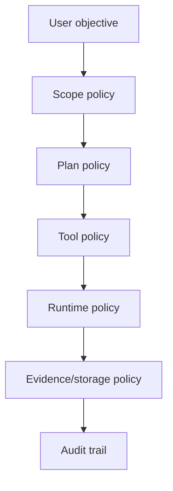
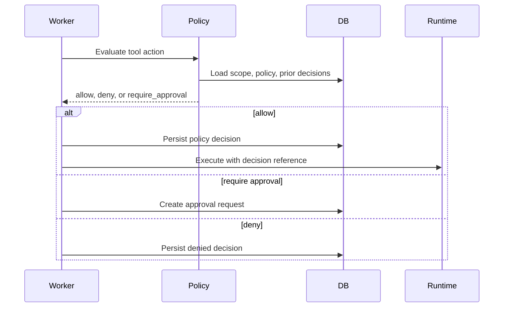

# ScopeForge Security Policy Design

## 1. Purpose

This document defines how ScopeForge decides whether a requested action is allowed, denied, or requires human approval.

The policy system must be deterministic, auditable, and independent of prompts.

## 2. Goals

- Enforce authorized scope.
- Prevent accidental or unauthorized activity.
- Require approval for high-risk actions.
- Preserve policy decisions for audit.
- Keep policy checks reusable across API, worker, and runtime service.
- Make default behavior conservative.

## 3. Non-Goals

- Do not let the LLM decide final safety policy.
- Do not hide policy outcomes in prompt text only.
- Do not create offensive capability without explicit scope, approval, and audit.
- Do not rely on runtime isolation as the only safety layer.

## 4. Policy Layers



Each layer can allow, deny, or require approval.

## 5. Decision Contract

Policy evaluation returns:

```json
{
  "decision": "allow",
  "risk_level": "medium",
  "reasons": ["Target host is in approved scope."],
  "matched_rules": ["scope.allowed_host"],
  "required_approval": null,
  "constraints": {
    "timeout_seconds": 300,
    "allowed_hosts": ["approved.example.com"]
  }
}
```

Allowed decision values:

| Decision | Meaning |
| --- | --- |
| `allow` | Action may proceed with constraints |
| `deny` | Action must not proceed |
| `require_approval` | Human approval is needed |

## 6. Policy Inputs

Policy engine input:

```text
PolicyInput
  workspace_id
  project_id
  session_id
  scope_id
  actor_type
  actor_id
  action_type
  tool_name
  tool_arguments
  target
  runtime_profile
  current_risk
  prior_decisions
```

The input must be structured. Natural language can be included as context, but it cannot be the only representation of scope or target.

## 7. Scope Policy

Scope defines what the session is allowed to touch.

Scope data should include:

- Allowed domains.
- Allowed IP ranges.
- Allowed URLs.
- Denied domains or IP ranges.
- Time windows.
- Rate limits.
- Required approval levels.
- Environment labels such as staging, internal, production.

Rules:

- Default deny when target cannot be classified.
- Deny known out-of-scope targets.
- Require approval when target is sensitive or ambiguous.
- Record the normalized target used in the decision.

## 8. Tool Policy

Tool policy decides if a registered tool may run with given arguments.

Evaluation checks:

- Is the tool enabled?
- Is the tool allowed for this workspace?
- Is the tool allowed for this session mode?
- Is the target in scope?
- Does the tool risk level require approval?
- Are arguments valid and bounded?
- Are rate limits or budgets exceeded?

## 9. Runtime Policy

Runtime policy is the enforcement layer closest to execution.

Runtime constraints can include:

- Allowed hostnames.
- Denied hostnames.
- Network mode.
- Command timeout.
- Maximum output bytes.
- CPU and memory limits.
- Workspace path restrictions.
- Environment variable allowlist.

Runtime service must reject commands missing a valid policy decision reference.

## 10. Approval Policy

Approval gates are required when:

- Policy returns `require_approval`.
- Risk level is `high` or `critical`.
- Target is sensitive.
- Scope is ambiguous.
- Session mode requires human confirmation.
- The action changes runtime, files, credentials, or reporting in a sensitive way.

Approval records must include:

- Requested action.
- Risk level.
- Reason.
- Matched policy rules.
- Requesting agent role.
- Expiration.
- Resolver user and note.

## 11. Policy Evaluation Flow



## 12. Policy Storage

The existing `policies` table can start with JSONB for fast iteration.

Suggested structure:

```json
{
  "default_action": "deny",
  "scope_rules": [],
  "tool_rules": [],
  "approval_rules": [],
  "runtime_constraints": {},
  "rate_limits": {},
  "retention": {}
}
```

Later, high-value rules can be normalized into dedicated tables.

## 13. Audit Requirements

Persist policy decisions with:

- Input summary.
- Decision.
- Risk level.
- Matched rules.
- Constraints.
- Actor.
- Timestamp.
- Related session, task, step, and tool call.

Do not store secrets in policy decision payloads.

## 14. Default Policy Profile

Initial default:

| Area | Default |
| --- | --- |
| Unknown target | Deny |
| Out-of-scope target | Deny |
| Low-risk in-scope action | Allow |
| Medium-risk in-scope action | Allow or approval based on workspace setting |
| High-risk action | Require approval |
| Critical-risk action | Require approval or deny |
| Network access | Restricted to scope |
| File write | Workspace only |
| Secrets in logs | Mask |

## 15. Failure Modes

Policy engine unavailable:

- Deny new tool execution.
- Keep existing running commands governed by runtime timeouts.
- Emit session event.

Runtime cannot enforce constraint:

- Deny action or require approval depending on risk.
- Record reason.

Ambiguous target:

- Deny or require approval.
- Ask user to refine scope.

## 16. Testing Contract

Required tests:

- In-scope target allowed.
- Out-of-scope target denied.
- Unknown target denied by default.
- High-risk action creates approval request.
- Denied decision prevents runtime call.
- Runtime rejects missing policy decision.
- Workspace policy isolation.
- Policy decisions are persisted and audit-readable.
